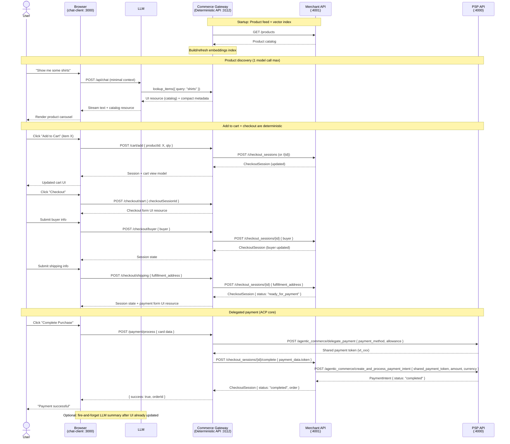

```mermaid
sequenceDiagram
    actor User
    participant Browser as Browser<br/>(chat-client :3000)
    participant LLM as LLM
    participant Gateway as Commerce Gateway<br/>(Deterministic API :3112)
    participant Merchant as Merchant API<br/>(:4001)
    participant PSP as PSP API<br/>(:4000)

    %% ── Startup ─────────────────────────────────────────────────────
    Note over Gateway,Merchant: Startup: Product feed + vector index
    Gateway->>Merchant: GET /products
    Merchant-->>Gateway: Product catalog
    Note over Gateway: Build/refresh embeddings index

    %% ── Discovery (only LLM-dependent path) ────────────────────────
    Note over User,PSP: Product discovery (1 model call max)
    User->>Browser: "Show me some shirts"
    Browser->>LLM: POST /api/chat (minimal context)
    LLM->>Gateway: lookup_items({ query: "shirts" })
    Gateway-->>LLM: UI resource (catalog) + compact metadata
    LLM-->>Browser: Stream text + catalog resource
    Browser-->>User: Render product carousel

    %% ── Deterministic Shopping (no LLM) ────────────────────────────
    Note over User,PSP: Add to cart + checkout are deterministic
    User->>Browser: Click "Add to Cart" (item X)
    Browser->>Gateway: POST /cart/add { productId: X, qty }
    Gateway->>Merchant: POST /checkout_sessions (or /{id})
    Merchant-->>Gateway: CheckoutSession (updated)
    Gateway-->>Browser: Session + cart view model
    Browser-->>User: Updated cart UI

    User->>Browser: Click "Checkout"
    Browser->>Gateway: POST /checkout/start { checkoutSessionId }
    Gateway-->>Browser: Checkout form UI resource

    User->>Browser: Submit buyer info
    Browser->>Gateway: POST /checkout/buyer { buyer }
    Gateway->>Merchant: POST /checkout_sessions/{id} { buyer }
    Merchant-->>Gateway: CheckoutSession (buyer updated)
    Gateway-->>Browser: Session state

    User->>Browser: Submit shipping info
    Browser->>Gateway: POST /checkout/shipping { fulfillment_address }
    Gateway->>Merchant: POST /checkout_sessions/{id} { fulfillment_address }
    Merchant-->>Gateway: CheckoutSession { status: "ready_for_payment" }
    Gateway-->>Browser: Session state + payment form UI resource

    %% ── Deterministic ACP Payment (no LLM) ─────────────────────────
    Note over User,PSP: Delegated payment (ACP core)
    User->>Browser: Click "Complete Purchase"
    Browser->>Gateway: POST /payment/process { card data }

    Gateway->>PSP: POST /agentic_commerce/delegate_payment { payment_method, allowance }
    PSP-->>Gateway: Shared payment token (vt_xxx)

    Gateway->>Merchant: POST /checkout_sessions/{id}/complete { payment_data.token }
    Merchant->>PSP: POST /agentic_commerce/create_and_process_payment_intent { shared_payment_token, amount, currency }
    PSP-->>Merchant: PaymentIntent { status: "completed" }
    Merchant-->>Gateway: CheckoutSession { status: "completed", order }
    Gateway-->>Browser: { success: true, orderId }
    Browser-->>User: "Payment successful"

    %% Optional narration can be async/non-blocking
    Note over Browser,LLM: Optional: fire-and-forget LLM summary after UI already updated

```