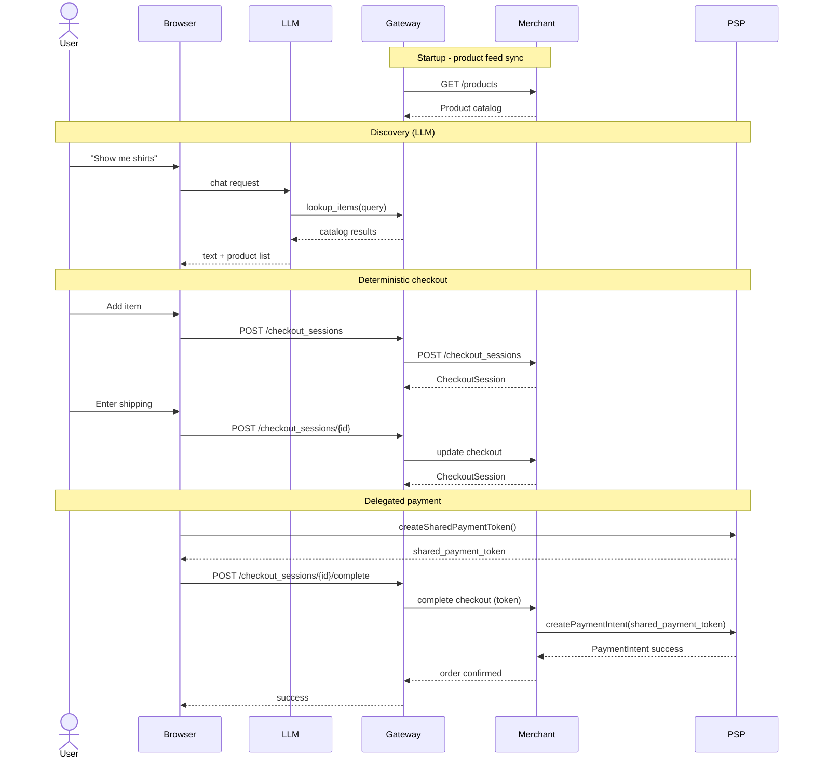

```mermaid
sequenceDiagram
    actor User
    participant Browser
    participant LLM
    participant Gateway
    participant Merchant
    participant PSP

    Note over Gateway,Merchant: Startup - product feed sync

    Gateway->>Merchant: GET /products
    Merchant-->>Gateway: Product catalog

    Note over User,PSP: Discovery (LLM)

    User->>Browser: "Show me shirts"
    Browser->>LLM: chat request
    LLM->>Gateway: lookup_items(query)
    Gateway-->>LLM: catalog results
    LLM-->>Browser: text + product list

    Note over User,PSP: Deterministic checkout

    User->>Browser: Add item
    Browser->>Gateway: POST /checkout_sessions
    Gateway->>Merchant: POST /checkout_sessions
    Merchant-->>Gateway: CheckoutSession

    User->>Browser: Enter shipping
    Browser->>Gateway: POST /checkout_sessions/{id}
    Gateway->>Merchant: update checkout
    Merchant-->>Gateway: CheckoutSession

    Note over User,PSP: Delegated payment

    Browser->>PSP: createSharedPaymentToken()
    PSP-->>Browser: shared_payment_token

    Browser->>Gateway: POST /checkout_sessions/{id}/complete
    Gateway->>Merchant: complete checkout (token)

    Merchant->>PSP: createPaymentIntent(shared_payment_token)
    PSP-->>Merchant: PaymentIntent success

    Merchant-->>Gateway: order confirmed
    Gateway-->>Browser: success
```