# ACP Workflow Walkthrough — Source Code Deep Dive

This document traces the full Agentic Commerce Protocol (ACP) flow through this repo's source code, from the chat client's initial product search all the way to a completed order. Three services participate:

| Role | Service | Port |
|---|---|---|
| **Client** | `chat-client` + `demo/mcp-ui-server` | 3000 + 3112 |
| **Merchant** | `demo/merchant` | 4001 |
| **PSP** | `demo/psp` | 4000 |

---

## Architecture Overview

The "Client" in ACP terms is split across two processes:

```
Browser (chat-client, :3000)
  └─ Next.js API route (/api/chat)
       └─ Vercel AI SDK streamText()
            └─ MCP tools (SSE connection to :3112)
                  └─ MCP UI Server (demo/mcp-ui-server, :3112)
                        ├─ REST routes  →  Merchant API (:4001)
                        └─ REST routes  →  PSP API (:4000)
```

The MCP UI server acts as the "brain" of the client side: it holds the ACP session state, calls the Merchant and PSP, and renders all in-chat HTML UI through MCP-UI resources.

---

## Step 0 — Startup: Product Feed Ingestion

**File:** `demo/mcp-ui-server/src/services/ProductFeedService.ts`

Before the first user message, the MCP server fetches the merchant's full product catalog and caches it in memory:

```ts
// ProductFeedService.ts:34-38
const response = await fetch(`${this.merchantBaseUrl}/products`, {
  headers: {
    'Authorization': `Bearer ${this.merchantApiKey}`,
    'api-version': process.env.MERCHANT_API_VERSION || '2025-09-29'
  }
});
```

Then `ProductSearchService` embeds every product name+description using the `all-MiniLM-L6-v2` model (~25 MB, runs in-process):

```ts
// ProductSearchService.ts:62-73
this.productVectors = await Promise.all(
  products.map(async (product) => {
    const text = `${product.name}. ${product.description}`;
    const embedding = await this.embed(text);
    return { product, embedding };
  })
);
```

This is the **Product Feed** part of ACP: the client ingests the merchant's catalog once and uses it locally for retrieval.

---

## Step 1 — User Sends a Message

**File:** `chat-client/app/api/chat/route.ts`

Every chat message hits `POST /api/chat`. The route connects to the MCP server over SSE, retrieves the available tools, then calls the LLM:

```ts
// route.ts:70-71
const { tools, cleanup } = await initializeMCPClients(mcpServers, req.signal);
const modelMessages = prepareMessagesForModel(messages, tools);
```

The MCP client connection (`lib/mcp-client.ts`) uses the Vercel AI SDK's experimental MCP client:

```ts
// mcp-client.ts:49-52
const mcpClient = await createMCPClient({ transport });
const mcptools = await mcpClient.tools();
tools = { ...tools, ...mcptools };
```

The LLM is then called with all MCP tools available:

```ts
// route.ts:76-96
const result = streamText({
  model: model.languageModel(selectedModel),
  system: `You are a helpful assistant with access to commerce tools.`,
  messages: modelMessages,
  tools,
  maxSteps: MAX_AGENT_STEPS,   // up to 6 LLM → tool → LLM loops
  ...
});
```

---

## Step 2 — Product Discovery: `lookup_items` Tool

**File:** `demo/mcp-ui-server/src/tools/lookup-items.ts`

When the user says "show me some shirts", the LLM calls the `lookup_items` tool. The tool does a vector similarity search:

```ts
// lookup-items.ts:27-43
async ({ query }) => {
  const limit = 5;
  const searchResults = await productSearchService.search(query, limit);

  const cartItems = new Set<string>();
  if (merchantService.hasActiveSession(sessionId)) {
    const activeSession = merchantService.getActiveSession(sessionId);
    activeSession?.line_items.forEach(li => cartItems.add(li.item.id));
  }

  const htmlContent = generateCatalogHTML(searchResults, cartItems, port);

  const uiResource = createUIResource({
    uri: `ui://search/${Date.now()}`,
    content: { type: 'rawHtml', htmlString: htmlContent },
    encoding: 'text',
  });

  return { content: [uiResource] };
}
```

The search uses cosine similarity over the pre-built embedding index:

```ts
// ProductSearchService.ts:117-127
const queryEmbedding = await this.embed(query);
const similarities = this.productVectors.map((pv) => ({
  product: pv.product,
  score: this.cosineSimilarity(queryEmbedding, pv.embedding),
}));
similarities.sort((a, b) => b.score - a.score);
return similarities.slice(0, k).map((s) => s.product);
```

The result is a **MCP-UI resource** — raw HTML that the chat client renders as an interactive product carousel inside the chat bubble. No merchant API call happens yet.

---

## Step 3 — Add to Cart → Open Checkout Session

**File:** `demo/mcp-ui-server/src/routes/cart.ts` and `services/MerchantSessionService.ts`

When the user clicks "Add to Cart" in the in-chat carousel, the HTML posts to the MCP server's REST endpoint:

```ts
// cart.ts:14-37
app.post('/cart/add', async (req, res) => {
  const { productId } = req.body;
  const session = await merchantService.addItemsToCart(
    sessionId, [{ id: productId, quantity: 1 }]
  );
  ...
});
```

`addItemsToCart` either creates a new session or merges into an existing one:

```ts
// MerchantSessionService.ts:203-233
async addItemsToCart(mcpSessionId, items) {
  if (!this.hasActiveSession(mcpSessionId)) {
    return this.createSession(mcpSessionId, items);   // first item → create
  } else {
    // merge quantities, then update
    return this.updateSession(mcpSessionId, { items: mergedItems });
  }
}
```

**`createSession`** calls the Merchant API:

```ts
// MerchantSessionService.ts:126-139
const response = await fetch(`${this.merchantBaseUrl}/checkout_sessions`, {
  method: 'POST',
  headers: this.buildHeaders(),   // Authorization, API-Version, Idempotency-Key, etc.
  body: JSON.stringify({ items }),
});
const session: CheckoutSession = await response.json();
this.activeSessions.set(mcpSessionId, session);
return session;
```

**ACP endpoint hit:** `POST /checkout_sessions` on the Merchant.

---

## Step 4 — Merchant Creates the Session

**File:** `demo/merchant/src/controllers/CheckoutController.ts` and `services/SessionManager.ts`

The merchant validates items, looks up prices, calculates totals, and persists to PostgreSQL:

```ts
// SessionManager.ts:44-104
async createSession(request) {
  const sessionId = `cs_${uuidv4()}`;
  const { lineItems, errors, requiresShipping } = await this.validateAndBuildLineItems(request.items);
  const fulfillmentOptions = this.fulfillmentManager.generateOptions(requiresShipping, ...);
  const totals = this.pricingCalculator.calculateTotals(lineItems, fulfillmentCost, ...);
  const status = this.determineStatus(lineItems, requiresShipping, ...);

  const session: CheckoutSession = {
    id: sessionId,
    payment_provider: { provider: 'stripe', supported_payment_methods: ['card'] },
    status,   // 'not_ready_for_payment' until shipping address provided
    currency: 'usd',
    line_items: lineItems,
    totals,
    ...
  };

  await this.saveSession(session);
  return session;
}
```

The controller echoes back `Idempotency-Key` and `Request-Id` headers as required by the ACP spec:

```ts
// CheckoutController.ts:160-165
const responseHeaders = {
  'Idempotency-Key': req.headers['idempotency-key'],
  'Request-Id': req.headers['request-id'],
};
res.status(201).set(responseHeaders).json(session);
```

The returned `CheckoutSession` is the ACP source of truth. The MCP server stores it locally:

```ts
// MerchantSessionService.ts:137-138
this.activeSessions.set(mcpSessionId, session);
return session;
```

---

## Step 5 — Cart Updates (Add/Remove Items)

**File:** `demo/mcp-ui-server/src/routes/cart.ts`

Removing an item with remaining items left calls `updateSession`:

```ts
// MerchantSessionService.ts:154-160
const response = await fetch(
  `${this.merchantBaseUrl}/checkout_sessions/${currentSession.id}`,
  { method: 'POST', headers: this.buildHeaders(), body: JSON.stringify(updates) }
);
```

**ACP endpoint hit:** `POST /checkout_sessions/{id}` — the generic update endpoint.

If the cart is emptied, the session is cancelled:

```ts
// cart.ts:72-73
const canceledSession = await merchantService.cancelSession(sessionId);
```

**ACP endpoint hit:** `POST /checkout_sessions/{id}/cancel`.

Each update response from the merchant becomes the new source of truth for the local session cache.

---

## Step 6 — Collect Buyer Info: `collect_buyer_info` Tool

**File:** `demo/mcp-ui-server/src/tools/collect-buyer-info.ts`

When the user clicks "Checkout", the LLM calls `collect_buyer_info`. The tool renders an inline HTML form (3-step wizard: contact → shipping → review) as a MCP-UI resource:

```ts
// collect-buyer-info.ts:11-12
server.registerTool('collect_buyer_info', {
  description: 'Collects buyer contact information and shipping address for checkout.',
  inputSchema: {},
}, async () => {
  const checkoutSessionId = currentSession?.id || '';
  // ... returns rawHtml with the 3-step form
  const uiResource = createUIResource({
    uri: `ui://checkout/${Date.now()}`,
    content: { type: 'rawHtml', htmlString: htmlContent },
    encoding: 'text',
  });
  return { content: [uiResource] };
});
```

When the user fills in their name/email and clicks "Next", the in-chat form POSTs buyer data directly to the MCP server:

```js
// (inside the HTML template, collect-buyer-info.ts:463-479)
const response = await fetch('http://localhost:' + PORT + '/checkout/buyer', {
  method: 'POST',
  headers: { 'Content-Type': 'application/json' },
  body: JSON.stringify({ buyer: formData.buyer })
});
```

The MCP server relays this to the merchant:

```ts
// cart.ts:127-149
app.post('/checkout/buyer', async (req, res) => {
  const session = await merchantService.updateSession(sessionId, { buyer });
  res.json({ message: 'Buyer info updated', session });
});
```

**ACP endpoint hit:** `POST /checkout_sessions/{id}` with `{ buyer: { first_name, last_name, email, phone_number } }`.

Similarly, the shipping address step POSTs to `/checkout/shipping`:

```js
// (inside the HTML template, collect-buyer-info.ts:534-540)
const response = await fetch('http://localhost:' + PORT + '/checkout/shipping', {
  method: 'POST',
  body: JSON.stringify({ fulfillment_address: formData.shipping })
});
```

```ts
// cart.ts:153-176
app.post('/checkout/shipping', async (req, res) => {
  const session = await merchantService.updateSession(sessionId, { fulfillment_address });
  res.json({ session });
});
```

**ACP endpoint hit:** `POST /checkout_sessions/{id}` with `{ fulfillment_address: { name, line_one, city, state, country, postal_code } }`.

After the shipping address is provided the merchant transitions the session status to `ready_for_payment`.

When the user clicks "Confirm & Continue to Payment", the HTML form uses MCP-UI's `postMessage` bridge to trigger the next tool call from within the iframe:

```js
// collect-buyer-info.ts:588-594
window.parent.postMessage({
  type: 'tool',
  payload: {
    toolName: 'collect_payment_details',
    params: {}
  }
}, '*');
```

---

## Step 7 — Collect Payment Details: `collect_payment_details` Tool

**File:** `demo/mcp-ui-server/src/tools/collect-payment-details.ts`

The tool validates that the session has complete contact and shipping info before rendering the card form:

```ts
// collect-payment-details.ts:28-45
if (!merchantService.hasCompleteContactInfo(sessionId)) {
  return { content: [{ type: 'text', text: 'Error: Please provide contact information first.' }], isError: true };
}
if (!merchantService.hasShippingAddress(sessionId)) {
  return { content: [{ type: 'text', text: 'Error: Please provide your shipping address first.' }], isError: true };
}
```

The total amount is read directly from the cached session:

```ts
// collect-payment-details.ts:50-51
const totalAmount = currentSession?.totals?.find(t => t.type === 'total')?.amount || 0;
```

The rendered HTML shows a card form pre-populated with the total, and submits to `/payment/process` on the MCP server:

```js
// (inside the HTML template, collect-payment-details.ts:352-364)
const response = await fetch('http://localhost:' + PORT + '/payment/process', {
  method: 'POST',
  body: JSON.stringify({ cardName, cardNumber, expMonth, expYear, cvc })
});
```

---

## Step 8 — Delegated Payment: Client → PSP

**File:** `demo/mcp-ui-server/src/routes/payment.ts`

This is the core of the ACP **Delegated Checkout** flow. The MCP server's `/payment/process` handler orchestrates two sequential API calls.

**First: delegate card data to the PSP.**

```ts
// payment.ts:50-98
const pspRequestBody = {
  payment_method: {
    type: 'card',
    card_number_type: 'fpan',
    number: cardNumber,
    exp_month: expMonth,
    exp_year: expYear,
    cvc: cvc,
    name: cardName,
    ...
  },
  allowance: {
    reason: 'one_time',
    max_amount: totalAmount,
    currency: 'usd',
    checkout_session_id: checkoutSessionId,
    merchant_id: 'merchant_123',
    expires_at: new Date(Date.now() + 3600000).toISOString()
  },
  billing_address: billingAddress,
  risk_signals: [{ type: 'card_testing', score: 5, action: 'authorized' }],
  metadata: { source: 'mcp_checkout' }
};

const pspResponse = await fetch(`${PSP_URL}/agentic_commerce/delegate_payment`, {
  method: 'POST',
  headers: {
    'Authorization': `Bearer ${PSP_CLIENT_API_KEY}`,
    'API-Version': PSP_API_VERSION,
    'Idempotency-Key': `payment_${Date.now()}_${Math.random()}`,
    ...
  },
  body: JSON.stringify(pspRequestBody)
});
```

**ACP endpoint hit:** `POST /agentic_commerce/delegate_payment` on the PSP.

---

## Step 9 — PSP Vaults the Card, Returns a Token

**File:** `demo/psp/src/routes/delegatePayment.ts` and `services/VaultTokenService.ts`

The PSP validates headers and the request body, then mints a vault token:

```ts
// delegatePayment.ts:47-55
const vaultToken = await VaultTokenService.createVaultToken({
  payment_method: req.body.payment_method,
  allowance: req.body.allowance,
  billing_address: req.body.billing_address,
  risk_signals: req.body.risk_signals,
  metadata: req.body.metadata,
  idempotency_key: idempotencyKey,
  request_id: requestId,
});
```

The token is stored in PostgreSQL and returned:

```ts
// VaultTokenService.ts:33-66
static async createVaultToken(data): Promise<VaultTokenResponse> {
  const vaultTokenId = `vt_${randomId}`;    // e.g., vt_3f4a9b2c1d...
  await pool.query(
    `INSERT INTO vault_tokens (id, created, payment_method, allowance, ...) VALUES (...)`,
    [vaultTokenId, ...]
  );
  return { id: vaultTokenId, created, metadata };
}
```

The raw card data never leaves the PSP database. Only the opaque `vt_...` token is returned to the client.

---

## Step 10 — Complete Checkout: Client → Merchant

**File:** `demo/mcp-ui-server/src/routes/payment.ts`

Back in `/payment/process`, the MCP server takes the vault token and calls the merchant's complete endpoint:

```ts
// payment.ts:113-142
const vaultToken = pspData.id;   // e.g., "vt_3f4a9b2c1d..."

const merchantResponse = await fetch(
  `${MERCHANT_URL}/checkout_sessions/${checkoutSessionId}/complete`,
  {
    method: 'POST',
    headers: {
      'Authorization': `Bearer ${MERCHANT_API_KEY}`,
      'Idempotency-Key': `complete_${Date.now()}_${Math.random()}`,
      ...
    },
    body: JSON.stringify({
      buyer: { first_name: ..., last_name: ..., email: ..., phone_number: ... },
      payment_data: {
        token: vaultToken,
        provider: 'stripe'
      }
    })
  }
);
```

**ACP endpoint hit:** `POST /checkout_sessions/{id}/complete` on the Merchant.

---

## Step 11 — Merchant Charges the Token via PSP

**File:** `demo/merchant/src/services/SessionManager.ts` and `services/PaymentService.ts`

The merchant's `completeSession` method requires the session to be in `ready_for_payment` status, then calls its own PSP client:

```ts
// SessionManager.ts:344-365
const totalAmount = session.totals.find(t => t.type === 'total')?.amount || 0;

const paymentIntent = await this.paymentService.processPayment({
  shared_payment_token: request.payment_data.token,
  amount: totalAmount,
  currency: session.currency,
});

if (paymentIntent.status !== 'completed') {
  throw new Error(`Payment processing failed with status: ${paymentIntent.status}`);
}
```

`PaymentService.processPayment` calls the PSP's merchant-authenticated endpoint:

```ts
// PaymentService.ts:53-55
const response = await fetch(
  `${this.pspUrl}/agentic_commerce/create_and_process_payment_intent`,
  {
    method: 'POST',
    headers: {
      'Authorization': `Bearer ${this.merchantSecretKey}`,
      'Content-Type': 'application/json',
    },
    body: JSON.stringify({ shared_payment_token, amount, currency }),
  }
);
```

**ACP endpoint hit:** `POST /agentic_commerce/create_and_process_payment_intent` on the PSP (merchant-authenticated, different key than the client-facing endpoint).

---

## Step 12 — PSP Validates Token, Processes Payment, Invalidates Token

**File:** `demo/psp/src/services/PaymentIntentService.ts`

The PSP enforces all allowance constraints before processing:

```ts
// PaymentIntentService.ts:161-220
static async createAndProcessPaymentIntent(request) {
  // 1. Look up vault token; throw if missing, consumed, or expired
  const vaultToken = await this.validateVaultToken(shared_payment_token);

  // 2. Validate amount ≤ allowance.max_amount and currency matches
  this.validatePaymentDetails(amount, currency, vaultToken.allowance);

  // 3. Insert payment_intent record with status='pending'
  await pool.query(`INSERT INTO payment_intents ...`);

  // 4. Simulate processing (2-second delay)
  await this.simulatePaymentProcessing();

  // 5. Mark as completed
  await pool.query(`UPDATE payment_intents SET status = 'completed' ...`);

  // 6. Invalidate the vault token — cannot be reused
  await this.invalidateVaultToken(shared_payment_token);
  //   → UPDATE vault_tokens SET status = 'consumed' WHERE id = $1

  return { id: paymentIntentId, status: 'completed', amount, currency, ... };
}
```

The `consumed` status prevents double-spend — a second attempt with the same token is rejected at step 1.

---

## Step 13 — Merchant Creates the Order

**File:** `demo/merchant/src/services/SessionManager.ts`

With payment confirmed, the merchant creates a permanent order record:

```ts
// SessionManager.ts:381-427
const orderId = `order_${uuidv4()}`;
const order = {
  id: orderId,
  checkout_session_id: sessionId,
  permalink_url: `https://merchant.example.com/orders/${orderId}`,
};

await client.query('BEGIN');
await client.query(`INSERT INTO orders (id, checkout_session_id, permalink_url, payment_token, ...) VALUES (...)`);
await client.query(`UPDATE checkout_sessions SET status = 'completed', order_id = $2 ... WHERE id = $7`);
await client.query('COMMIT');
```

The completed `CheckoutSession` (now with `status: 'completed'` and an embedded `order` object) is returned up the call chain all the way to the browser.

---

## Step 14 — Cleanup and Confirmation

**File:** `demo/mcp-ui-server/src/routes/payment.ts`

After the merchant returns successfully, the MCP server:
1. Clears its local session cache.
2. Returns only non-sensitive data to the browser.

```ts
// payment.ts:150-163
merchantService.clearSession(sessionId);

res.json({
  success: true,
  orderId: orderId,
  status: merchantData.status
});
```

The in-chat payment form receives this response and shows a confirmation:

```js
// (HTML template, collect-payment-details.ts:374-379)
button.textContent = '✓ Payment Successful!';
setTimeout(() => {
  alert('Payment completed successfully! Order ID: ' + result.orderId);
}, 500);
```

---

## Complete Data Flow Summary

```mermaid
sequenceDiagram
    actor User
    participant Browser as Browser<br/>(chat-client :3000)
    participant LLM as LLM
    participant MCP as MCP Server<br/>(:3112)
    participant Merchant as Merchant API<br/>(:4001)
    participant PSP as PSP<br/>(:4000)

    %% ── Product Discovery ──────────────────────────────────────────
    Note over MCP,Merchant: Startup: Product Feed Ingestion
    MCP->>Merchant: GET /products
    Merchant-->>MCP: [ { id, name, description, price, ... } ]
    Note over MCP: Embeds all products with<br/>MiniLM-L6-v2 into vector index

    %% ── Shopping ───────────────────────────────────────────────────
    Note over User,PSP: Shopping
    User->>Browser: "Show me some shirts"
    Browser->>LLM: POST /api/chat (messages + MCP tools)
    LLM->>MCP: tool call: lookup_items({ query: "shirts" })
    Note over MCP: cosine similarity search<br/>over embedding index
    MCP-->>LLM: MCP-UI rawHtml (product carousel)
    LLM-->>Browser: stream: tool result + text
    Browser-->>User: renders product carousel in chat

    User->>Browser: clicks "Add to Cart" on product X
    Browser->>MCP: POST /cart/add { productId }
    MCP->>Merchant: POST /checkout_sessions { items: [{ id, qty }] }
    Merchant-->>MCP: CheckoutSession { id: "cs_...", status: "not_ready_for_payment", totals, ... }
    MCP-->>Browser: { session }

    User->>Browser: clicks "Add to Cart" on product Y
    Browser->>MCP: POST /cart/add { productId }
    MCP->>Merchant: POST /checkout_sessions/{id} { items: [X, Y] }
    Merchant-->>MCP: CheckoutSession (updated line_items + totals)
    MCP-->>Browser: { session }

    %% ── Buyer Info ──────────────────────────────────────────────────
    Note over User,PSP: Checkout — Buyer Info
    User->>Browser: "Checkout"
    Browser->>LLM: POST /api/chat
    LLM->>MCP: tool call: collect_buyer_info()
    MCP-->>LLM: MCP-UI rawHtml (contact + shipping wizard)
    LLM-->>Browser: stream: tool result
    Browser-->>User: renders 3-step checkout form in chat

    User->>Browser: fills contact info, clicks "Next"
    Browser->>MCP: POST /checkout/buyer { buyer }
    MCP->>Merchant: POST /checkout_sessions/{id} { buyer }
    Merchant-->>MCP: CheckoutSession (buyer updated)
    MCP-->>Browser: { session }

    User->>Browser: fills shipping address, clicks "Next"
    Browser->>MCP: POST /checkout/shipping { fulfillment_address }
    MCP->>Merchant: POST /checkout_sessions/{id} { fulfillment_address }
    Merchant-->>MCP: CheckoutSession { status: "ready_for_payment" }
    MCP-->>Browser: { session }

    User->>Browser: reviews info, clicks "Confirm & Continue to Payment"
    Note over Browser: postMessage({ toolName: 'collect_payment_details' })
    Browser->>LLM: POST /api/chat (tool trigger)
    LLM->>MCP: tool call: collect_payment_details()
    MCP-->>LLM: MCP-UI rawHtml (card payment form + total)
    LLM-->>Browser: stream: tool result
    Browser-->>User: renders payment form in chat

    %% ── Delegated Payment ───────────────────────────────────────────
    Note over User,PSP: Delegated Payment Flow (ACP Core)
    User->>Browser: enters card details, clicks "Complete Purchase"
    Browser->>MCP: POST /payment/process { cardName, cardNumber, expMonth, expYear, cvc }

    Note over MCP,PSP: Step A — Delegate card to PSP
    MCP->>PSP: POST /agentic_commerce/delegate_payment<br/>{ payment_method: { card_number, exp, cvc, ... },<br/>  allowance: { max_amount, currency, checkout_session_id, expires_at } }
    Note over PSP: vaults card data in DB<br/>generates vault token vt_...
    PSP-->>MCP: { id: "vt_xxxxx", created, metadata }

    Note over MCP,Merchant: Step B — Complete checkout with token
    MCP->>Merchant: POST /checkout_sessions/{id}/complete<br/>{ payment_data: { token: "vt_xxxxx", provider: "stripe" } }

    Note over Merchant,PSP: Merchant redeems token with PSP
    Merchant->>PSP: POST /agentic_commerce/create_and_process_payment_intent<br/>{ shared_payment_token: "vt_xxxxx", amount, currency }
    Note over PSP: validates token (not consumed, not expired,<br/>amount ≤ allowance.max_amount)<br/>processes payment<br/>marks token status = 'consumed'
    PSP-->>Merchant: { id: "pi_xxx", status: "completed", amount, currency }

    Note over Merchant: creates order record<br/>sets session status = 'completed'
    Merchant-->>MCP: CheckoutSession { status: "completed", order: { id: "order_xxx" } }

    Note over MCP: clears local session cache
    MCP-->>Browser: { success: true, orderId: "order_xxx" }
    Browser-->>User: "✓ Payment Successful! Order ID: order_xxx"
```



---

## Key ACP Spec Endpoints Implemented

### Merchant (`demo/merchant`, port 4001)

| Method | Path | Purpose |
|---|---|---|
| `POST` | `/checkout_sessions` | Create session with initial items |
| `GET` | `/checkout_sessions/{id}` | Retrieve session state |
| `POST` | `/checkout_sessions/{id}` | Update items / buyer / shipping |
| `POST` | `/checkout_sessions/{id}/complete` | Submit payment token, complete order |
| `POST` | `/checkout_sessions/{id}/cancel` | Cancel session |
| `GET` | `/products` | Product feed (non-ACP, used for catalog seeding) |

### PSP (`demo/psp`, port 4000)

| Method | Path | Caller | Purpose |
|---|---|---|---|
| `POST` | `/agentic_commerce/delegate_payment` | Client (MCP server) | Vault card data, return `vt_` token |
| `POST` | `/agentic_commerce/create_and_process_payment_intent` | Merchant | Charge vault token, return `pi_` intent |
| `GET` | `/agentic_commerce/payment_intents/{id}` | Merchant | Retrieve payment intent status |

### Required Headers (ACP spec)

All Merchant and PSP calls include:

```
Authorization: Bearer <api_key>
API-Version: 2025-09-29
Idempotency-Key: <unique_per_request>
Request-Id: <unique_per_request>
Timestamp: <ISO8601>
Signature: <base64_signature>
```

---

## Session State Machine

The merchant's `CheckoutSession.status` field follows this progression:

```
not_ready_for_payment   ← created with items only (no shipping)
        │
        ▼ (POST /checkout_sessions/{id} with fulfillment_address)
ready_for_payment       ← shipping address provided, totals finalized
        │
        ├─▶ canceled    ← POST /checkout_sessions/{id}/cancel
        │
        └─▶ completed   ← POST /checkout_sessions/{id}/complete (payment succeeded)
```

The merchant enforces these transitions: `completeSession` throws if status is not `ready_for_payment`; `cancelSession` throws if status is `completed`.

---

## Security Design Notes

1. **Card data isolation**: Raw card numbers flow `browser → MCP server → PSP` only. The Merchant never sees card data — it only receives the opaque `vt_` token.

2. **Two separate PSP auth keys**:
   - `PSP_CLIENT_API_KEY` — used by the MCP server (client role) to call `delegate_payment`
   - `PSP_MERCHANT_SECRET_KEY` — used by the Merchant to call `create_and_process_payment_intent` (enforced by `authenticateMerchant` middleware)

3. **One-time tokens**: The vault token `allowance.reason = 'one_time'` and is marked `consumed` after the payment intent is processed, preventing replay attacks.

4. **Allowance cap**: The PSP validates `amount <= allowance.max_amount` and `currency == allowance.currency`, so a rogue merchant cannot overcharge beyond what was shown to the user.

5. **Idempotency**: Both the Merchant and PSP store `Idempotency-Key` per request, returning cached responses for retried calls rather than double-charging.
