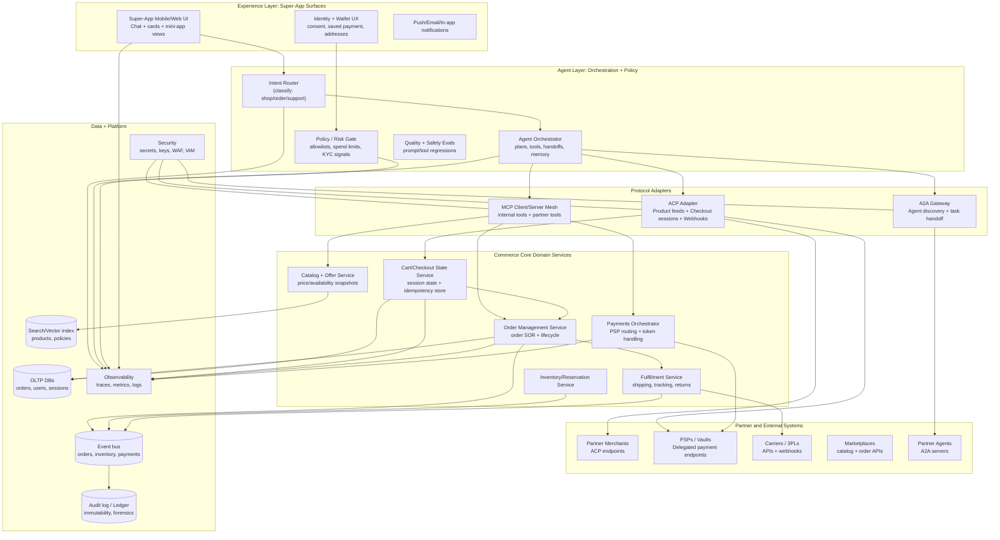
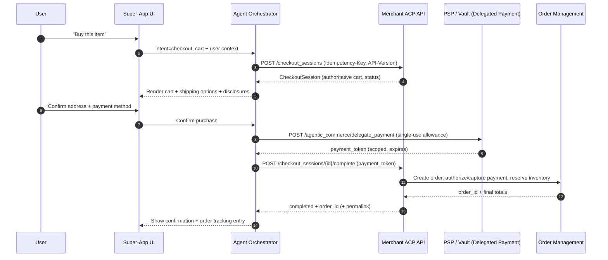
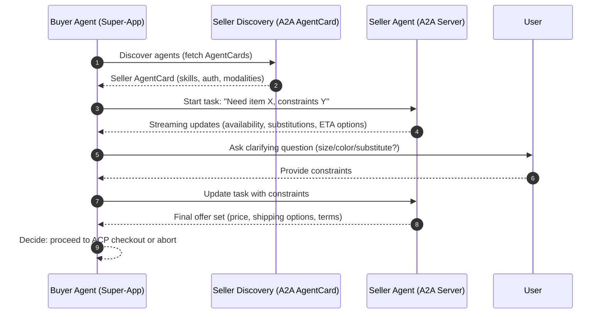
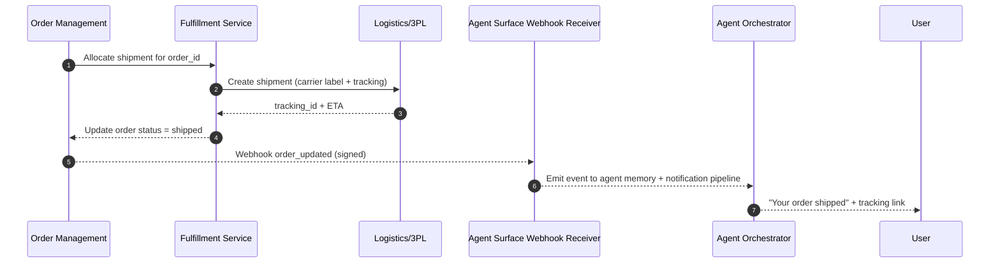

# Building an Agentic E‑commerce Super‑App with A2A, MCP, and ACP (2023–2026)

## Executive summary

Agentic e‑commerce moved from “shopping assistants that recommend” (2023–2024) to “transaction-capable agents that can complete checkout inside the AI surface” (late 2025–early 2026). This shift has been driven by three converging forces: (1) better agent architectures (tool use, planning, multi-agent collaboration), (2) protocol standardization for interoperability (MCP for tools/data; A2A for agent-to-agent collaboration), and (3) new commerce primitives that keep merchants as merchant-of-record while enabling in-chat checkout (ACP plus delegated/“shared” payment tokenization). citeturn2search2turn2search1turn2search11turn11view4turn11view0turn13view1turn12view1

In this ecosystem, ACP (Agentic Commerce Protocol) is effectively the **checkout “contract”** between an agent surface and a merchant: merchants expose a small set of REST endpoints for checkout sessions and webhooks for order lifecycle events, and they retain control (accept/decline, payment processing, fulfillment, refunds/chargebacks). citeturn8view0turn7view1turn10view2turn7view0 Meanwhile, MCP (Model Context Protocol) standardizes how agents securely connect to enterprise tools and data via a host/client/server model over JSON-RPC 2.0; and A2A (Agent2Agent) standardizes “agent-as-agent” collaboration (capability discovery, task handoff, streaming/asynchronous progress) on top of common transports like HTTP/SSE/JSON-RPC. citeturn11view3turn11view4turn11view0turn11view1turn11view2

For a super‑app entry point (like Grab/WeChat), the architectural implication is that **your app becomes the orchestration and governance layer**: it routes intent to specialized agents, performs policy checks, mediates identity/consent, and brokers protocol adapters (ACP for commerce checkout, MCP for tools/data, A2A for cross-agent negotiation with partners). Super‑apps already prove out the “single app, many services” model; agentic commerce adds a new “transaction surface” that can live inside chat, cards, and mini-app UX. citeturn5search1turn5search2turn5search0turn13view1turn12view0

This report proposes a production architecture optimized for: (a) **merchant-of-record preservation** (critical for risk/compliance and partner adoption), (b) **interoperability-first integrations** (protocol adapters and versioned schemas), and (c) **resilient distributed transactions** (sagas, idempotency, deterministic retries, and signed webhooks). citeturn10view0turn4search0turn4search5turn4search3turn14view0

## Trends and market direction 2023–2026

A useful way to understand “agentic e‑commerce” is to split it into (1) **agent capability trends**, (2) **standardization trends**, and (3) **checkout + payment primitive trends**.

**Agent capability trends (2023–2025): tool use → self-improvement → multi-agent collaboration.** In 2023, research and open tooling emphasized how LLMs can learn to call tools and incorporate results (e.g., Toolformer), and how agent performance can improve via language-feedback memory rather than weight updates (e.g., Reflexion). citeturn2search2turn2search1 In parallel, multi-agent orchestration frameworks matured (e.g., AutoGen), reflecting a practical realization: complex real workflows benefit from multiple specialized agents coordinating. citeturn2search11turn2search3 Surveys in 2024–2025 crystallized planning/reasoning/tool-use patterns and failure modes, which directly map to e‑commerce tasks like discovery → comparison → constraints → checkout. citeturn2search0turn2search4turn2search28

**Standardization trends (2024–2026): MCP and A2A as “plumbing” for an agent ecosystem.** In November 2024, entity["company","Anthropic","ai company"] introduced MCP as an open standard for secure, two-way connections between AI tools and external data sources, positioning it as a remedy for fragmented integrations. citeturn11view4turn1search4 MCP’s spec formalizes a host/client/server model over JSON‑RPC 2.0, which is important because it enables tool discovery and consistent invocation semantics. citeturn11view3 By 2025–2026, MCP governance and adoption signals strengthened (e.g., donation to a neutral foundation and broad vendor support reported by major tech press). citeturn1search22turn1news44turn1news41

In April 2025, entity["company","Google","technology company"] announced A2A as an open protocol for agent interoperability, explicitly framing it as complementary to MCP: MCP links agents to tools and context; A2A links agents to other agents—especially relevant when agents are “opaque” and do not share internal state or memory. citeturn11view0turn11view1 A2A details focus on capability discovery (Agent Cards), negotiation of modalities, asynchronous-first task management, and streaming progress—elements that map well to partner negotiations and long-running order fulfillment updates. citeturn11view1turn11view5

**Checkout + payment primitive trends (late 2025–early 2026): embedded checkout moves upstream into AI conversations.** On September 29, 2025, OpenAI launched Instant Checkout in ChatGPT and publicized ACP (open-sourced, co-developed with entity["company","Stripe","payments company"]) as the protocol enabling agentic checkout while keeping merchants in control as merchant of record. citeturn13view1turn6search16turn7view0 The user experience pattern is consistent: product discovery and comparison occur in-chat; users tap “Buy”; checkout completes without leaving the AI surface; and orders, payments, and fulfillment remain on the merchant’s systems. citeturn13view0turn13view1turn8view0 OpenAI’s help-center documentation emphasizes a buyer-visible “Buy button,” multiple payment methods, and the key governance point that OpenAI is not merchant of record (merchant handles shipping/returns/support). citeturn13view0

In January 2026, entity["company","Microsoft","technology company"] announced Copilot Checkout—again “no redirect” and “merchant stays merchant of record”—with payments and seller connectivity described as being powered by Stripe and ACP integration patterns. citeturn12view0turn12view1turn12view4 Tech press coverage framed this as part of an industry contest to control the checkout funnel inside AI assistants rather than on merchant websites. citeturn12view3turn12view4

A parallel trend (important even if you build primarily on ACP) is that other ecosystems are concurrently launching their own commerce standards and “agentic checkout” experiences, signaling a multi-protocol world where merchants will expect adapters rather than bespoke point integrations. citeturn6search0turn6news40turn6search26

image_group{"layout":"carousel","aspect_ratio":"16:9","query":["WeChat mini program shopping checkout screenshot","Grab super app home screen services screenshot","WeChat Pay checkout interface screenshot","Super app mini app platform architecture illustration"],"num_per_query":1}

## Protocol deep dive: ACP, A2A, MCP, and checkout primitives

### What ACP standardizes in practice

ACP (as published in OpenAI’s commerce documentation and the open-source spec repo maintained by OpenAI + Stripe) defines how an agent and a merchant coordinate checkout while **preserving merchant control**. citeturn7view0turn7view6turn3search0

From an integration standpoint, OpenAI’s commerce docs require three flows for Instant Checkout enablement:

1) **Product feeds**: merchants provide structured catalog feeds (CSV/JSON) so product discovery surfaces accurate price/availability; citeturn7view4turn7view2turn9search5  
2) **Agentic checkout REST API**: merchants implement checkout session endpoints (create/update/complete/cancel) returning “authoritative cart state” each time; citeturn8view0turn8view3turn8view4  
3) **Delegated payment**: payment providers (or PCI level 1 merchants with vaults) implement a delegated payment endpoint where OpenAI can securely send a single-use payload; the PSP returns a token; OpenAI forwards it in the completion call to the merchant. citeturn7view1turn7view5turn7view0

The open-source ACP RFCs add useful engineering-level detail that should influence your architecture even if you don’t implement Instant Checkout directly:

- **Versioning** via `API-Version` headers and explicit supported versions. citeturn14view0turn10view0  
- **Idempotency** required on all POST requests, with explicit conflict semantics and minimum retention windows. citeturn14view0turn10view0turn4search3  
- **Capability negotiation**: a standardized `capabilities` object whose “intersection” semantics allow a seller to return only what is mutually supported for that session—important as payment methods and authentication interventions diversify. citeturn15view0  
- **Payment handler framework** direction: “payment handlers” as rich declarations describing configuration, schemas, and delegation/PCI requirements. citeturn15view1

### Delegated payment and “shared payment tokens” as the security hinge

OpenAI’s delegated payment spec explicitly aims to securely share payment details to a merchant’s PSP/vault, producing a **single-use token restricted by max amount and expiry**; it stresses that merchants are merchant of record and settlement/refunds/chargebacks remain with the merchant + PSP. citeturn7view1turn10view2

Stripe’s “shared payment tokens” (SPTs) are presented as a concrete primitive for this model: an agent grants an SPT to the seller with usage/expiration limits so the seller can process payment without seeing underlying credentials; Stripe documentation frames SPTs as scoped grants, and Stripe’s newsroom describes Copilot Checkout as using a Stripe-issued Shared Payment Token passed to the seller. citeturn19search0turn19search8turn12view1

### How A2A and MCP fit alongside ACP in a super-app

**MCP** is the “tool/data plane”: it provides the model-side mechanism to connect your orchestrator to internal systems (catalog, order history, CRM, loyalty, fraud signals) and partner APIs through standardized tool discovery and invocation. citeturn11view3turn18search1turn11view4

**A2A** is the “agent collaboration plane”: it enables your app’s agents to negotiate, delegate, and coordinate with third-party agents (merchant agents, logistics agents, marketplace agents) without requiring tool-level exposure. Google’s A2A announcement and spec emphasize capability discovery, modality negotiation, and secure collaboration, explicitly complementing MCP. citeturn11view0turn11view1turn11view2

### Protocol comparison table

| Dimension | ACP (checkout contract) | MCP (tools/data contract) | A2A (agent collaboration contract) |
|---|---|---|---|
| Primary objective | Standardize agent ↔ merchant checkout sessions + payment delegation + order updates for embedded checkout | Standardize model/app ↔ tools/data connections | Standardize agent ↔ agent discovery, collaboration, and task coordination |
| Canonical roles | Buyer agent, merchant/seller, PSP/vault | Host, client connectors, MCP servers | Client agent, server agent, AgentCard discovery |
| Transport + core format | REST endpoints + webhooks for checkout; delegated payment endpoints; versioning + idempotency in headers citeturn8view0turn7view1turn10view0turn14view0 | JSON‑RPC 2.0 between host/client/server; spec defines normative requirements citeturn11view3turn1search4 | Built on existing standards (HTTP, SSE, JSON‑RPC), async-first patterns, streaming updates citeturn11view0turn11view1turn11view5 |
| Security posture | Merchant-of-record preserved; delegated payment restricts token by amount/expiry; production guidance includes TLS + signed webhooks + allowlists citeturn7view1turn10view0turn10view2 | Requires secure, two-way connections; emphasis on reducing integration fragmentation; security must be implemented in servers/hosts citeturn11view4turn11view3turn18search6 | Secure exchange between opaque agents; encourages secure transport and authentication; designed to avoid sharing internal state/memory citeturn11view1turn11view5 |
| Why it matters for a super-app | Lets your super-app embed commerce checkout while partners keep existing commerce stacks; supports multi-platform distribution surfaces citeturn13view1turn7view0 | Lets your super-app agents safely use internal tools (catalog, fulfillment visibility, loyalty) without bespoke connectors citeturn11view4turn18search1 | Lets your super-app negotiate/coordinate with partner agents (e.g., merchant, logistics, insurer) beyond tool-style calls citeturn11view2turn11view5 |

## Concrete implementations and case studies

### OpenAI Instant Checkout and merchant integration surface

OpenAI’s public documentation lays out a concrete integration path: apply, supply a product feed, implement checkout session endpoints and order webhooks, and integrate via a PSP that supports the delegated payment spec (with Stripe’s Shared Payment Token described as the first compatible implementation). citeturn7view0turn8view0turn7view1turn10view0

Instant Checkout behavior (as described for buyers) includes a “Buy” button on eligible items, a checkout window in-chat, support for common payments, and an explicit statement that OpenAI is not merchant of record and the merchant handles shipping/returns/support. citeturn13view0turn13view1

### Microsoft Copilot Checkout as a cross-surface proof point

Microsoft Advertising’s Copilot Checkout announcement stresses: no redirects, frictionless conversion, and merchant remains merchant of record (transaction and customer relationship). citeturn12view0 Stripe’s newsroom states that Microsoft communicates with Stripe, Stripe connects with the seller via ACP, and Stripe issues a Shared Payment Token that the seller can process (on Stripe or other providers, while still using Stripe risk signals). citeturn12view1 Independent reporting similarly describes in-chat checkout for select retailers and payments powered via partner rails. citeturn12view3turn12view4

### Public code and reference implementations

The ecosystem already includes multiple public repos that are valuable as “design reference artifacts”:

- **ACP specification + RFCs** (maintained by OpenAI + Stripe): clarifies idempotency rules, versioning, capability negotiation, and payment handler direction. citeturn7view6turn14view0turn15view0turn15view1  
- **End-to-end sandbox/demos**: a public “mock implementation” repo demonstrates ACP flows across client, merchant, and PSP for experimentation. citeturn3search10  
- **Implementation helpers**: a package that “handles ACP protocol implementation so you focus on business logic” (useful for quick prototyping, but still assess security and spec completeness). citeturn3search33  
- **Merchant platform plugins**: a WooCommerce-focused ACP implementation suggests an emerging pattern: merchants will expect platform plugins rather than bespoke integrations. citeturn3search25  
- **Type-safe SDKs**: unofficial multi-language protocol implementations (useful to generate schemas and reduce integration errors). citeturn3search13turn3search18  

### A2A and MCP implementation examples

- **A2A codelab (purchasing concierge)**: demonstrates an A2A client doing discovery (AgentCards), sending messages to seller agents, and tracking task progression—directly relevant to “agent-to-agent negotiation” flows (price, fulfillment options, constraints) in commerce. citeturn11view2  
- **A2A spec and ecosystem**: the spec formalizes discovery and modality negotiation; Thoughtworks highlights async-first and secure transport patterns, reinforcing production suitability for long-running tasks. citeturn11view1turn11view5  
- **MCP official docs + servers**: Anthropic’s MCP intro points to SDKs and open server implementations; the spec defines JSON-RPC based requirements. citeturn11view4turn11view3turn1search5  
- **Stripe MCP server**: Stripe hosts a remote MCP server and documents MCP tooling for interacting with Stripe APIs and knowledge bases—important for finance workflows and merchant operations agents. citeturn3search16turn3search2  
- **OpenAI MCP tooling**: OpenAI documents how its Responses API supports remote MCP servers over “streamable HTTP” or HTTP/SSE, and notes that costs are token-based rather than per-tool-call fees (useful for cost modeling). citeturn18search1turn18search4  

## Reference production architecture

This architecture is written for a super‑app entry point where your company is the **experience + orchestration platform**, and commerce is delivered either by (a) your own first-party merchant stack, (b) partners using ACP, or (c) partner agents reachable via A2A.

### Layered production diagram



### Component responsibilities (what must be “production-grade”)

**Experience layer (super‑app frontend).** Your competitive edge is multi-surface UX: chat + product cards + embedded mini-apps. The system design implication: the frontend must support **progressive disclosure** (recommendations → compare → confirm), explicit user confirmation steps (especially for purchases), and interruption/rollback affordances (“cancel checkout,” “change shipping,” “switch payment”). OpenAI’s Instant Checkout UX and “Buy button” flow show the baseline user expectation for embedded checkout. citeturn13view0turn13view1turn8view0

**Agent orchestration.** Treat this as a control plane: intent routing, planning, tool selection, and governance. If you adopt OpenAI’s agent tooling, OpenAI documents agent workflows, MCP tool calling, and deployment surfaces (e.g., Agents SDK and MCP tool in Responses API), which gives you a reference for orchestration primitives (handoffs, tool calls, traces). citeturn18search3turn18search1turn18search0

**ACP adapter.** Implement as a dedicated boundary layer so your internal domain model (offers, carts, orders) can map cleanly to ACP requirements: version headers, idempotency headers, authoritative cart responses, and signed webhooks. citeturn8view0turn10view0turn14view0

**MCP mesh.** Use MCP to expose internal tools/data (catalog query, order lookup, loyalty eligibility, fraud signals) to your agents with consistent schemas and centralized auth policies. MCP’s host/client/server model provides a stable contract for that mesh. citeturn11view3turn11view4turn18search1

**A2A gateway.** Use when a partner is better modeled as an agent (negotiation, iterative clarification, long-running tasks, multi-modal results). A2A’s emphasis on discovery (AgentCards), modality negotiation, and task management fits “merchant concierge” and “fulfillment coordinator” patterns. citeturn11view1turn11view2turn11view5

**Commerce core.** Separate “commerce correctness” from “agent reasoning.” The checkout agent should not become your system of record. ACP explicitly keeps orders/payments/compliance on the merchant’s stack; mirror that principle internally: orders service is the SOR; payments orchestrator is safety-critical; inventory reservation must be deterministic and idempotent. citeturn8view0turn10view2turn14view0

**Observability + security + governance.** Agentic commerce expands attack surface (prompt injection, tool misuse, model DoS, supply chain vulnerabilities). OWASP explicitly documents these emerging LLM risks; OpenAI’s commerce production guidance calls out TLS requirements, PCI-scope boundaries, signed webhooks, and allowlisting outbound IP ranges. citeturn17search2turn10view0turn10view2

## Integration patterns and transaction models

### Message flow building blocks you should standardize

**Three “planes” simplify integration reasoning:**

1) **Synchronous command plane**: user-driven actions (create/update/complete checkout session) should be synchronous, low-latency, and idempotent. ACP formalizes these endpoints and expects “authoritative cart state” on every response. citeturn8view0turn14view0  
2) **Asynchronous event plane**: order lifecycle events and fulfillment updates should flow through webhooks and internal event bus. OpenAI’s Agentic Checkout spec includes order events via webhooks; production guidance includes webhook signature validation and idempotency testing. citeturn8view0turn10view0  
3) **Negotiation / collaboration plane**: when the workflow requires iterative clarification (substitutions, bundles, delivery constraints), use A2A flows rather than forcing everything into tool calls. citeturn11view2turn11view0

### Distributed transaction model: sagas over two-phase commit

Commerce is a classic multi-step workflow: reserve inventory, calculate tax/shipping, authorize payment, create order, allocate fulfillment, and emit confirmations. In microservices with database-per-service, two-phase commit is generally infeasible; AWS prescriptive guidance explicitly notes that two‑phase commit is not an option in such designs, and recommends saga patterns (choreography or orchestration). citeturn4search4turn4search8turn4search21 Azure similarly positions sagas as sequences of local transactions with compensating actions for failure recovery. citeturn4search5turn4search1

Pragmatically:

- Use **saga orchestration** for checkout/payment workflows (a single coordinator can enforce invariants like “no capture before inventory reserved,” “no duplicate order creation”). citeturn4search21turn4search5  
- Use **saga choreography** for partner fulfillment events where each party emits events and downstream services react (useful in marketplaces where you don’t control all participants). citeturn4search4turn4search8  

### Idempotency, retries, and error normalization

In agentic checkout, retries are normal (mobile network instability, backgrounding, tool timeouts). ACP’s RFC mandates idempotency keys on all POST endpoints and defines conflict handling; OpenAI’s production checklist explicitly tests that replaying the same Idempotency-Key yields the same result and that mismatched parameters produce a conflict error. citeturn14view0turn10view0 Payment APIs similarly require idempotent request patterns; Stripe documents idempotency keys and explains parameter-mismatch protections. citeturn4search3turn4search11

A recommended normalization strategy in your platform:

- Standardize **error taxonomies**: `invalid_request`, `out_of_stock`, `payment_declined`, `requires_3ds`, `service_unavailable` (these appear in ACP docs/RFCs). citeturn14view0turn15view0turn10view0  
- Make all “side-effect” commands **idempotent at the boundary** and **deduplicated in the domain** (store idempotency key → response mapping, with TTL). citeturn14view0turn4search3  
- Treat 5xx as **non-cacheable** for idempotency (as ACP RFC states) and use exponential backoff with jitter. citeturn14view0turn4search7  

### Key sequence diagrams (Mermaid)

#### Embedded checkout flow (ACP + delegated payment)



#### Agent-to-agent negotiation (A2A) before committing checkout



#### Third-party partner fulfillment and post‑purchase updates (event-driven)



## Scalability, latency, cost, security, and compliance

### Scalability and latency: where agentic commerce is different

**Two latency budgets matter:**

- **UI perceived latency** (sub‑second for browse/compare; a few seconds acceptable for “complete purchase”)  
- **workflow latency** (minutes/hours for fulfillment updates, refunds)

OpenAI’s production performance guidance explains that generation latency is dominated by token generation and model choice; for commerce, this implies you should stream partial results when browsing/comparing and keep “checkout completion” prompts short and schema-constrained. citeturn16view2 A2A’s async-first and streaming patterns similarly align with long-running negotiations and incremental updates. citeturn11view5turn11view2

**Scaling pattern:** isolate “agent reasoning” from “commerce correctness.”  
Agents scale elastically (stateless inference + short-lived memory caches), while commerce services scale with stricter correctness constraints (orders/payments). ACP reinforces this by keeping merchant backends as the system of record and expecting authoritative cart/order state from merchants on every call. citeturn8view0turn14view0

### Cost engineering: avoid “agent token burn” on deterministic operations

ACP is designed so deterministic operations (pricing, tax, stock validation) live in structured APIs rather than LLM reasoning. citeturn8view0turn7view2turn7view3 For MCP, OpenAI notes that MCP tool usage costs are based on token usage for importing tool definitions and making tool calls, not per-call fees, which suggests an optimization path: aggressively minimize tool schemas, use scoped toolsets, and cache tool definitions where possible. citeturn18search1

### Security model: explicit consent, constrained tokens, and hardened tool boundaries

Security posture in an agentic commerce funnel should assume that:

- user prompts can be adversarial (prompt injection),  
- tool outputs can be unsafe (insecure output handling), and  
- agent workloads can be exploited for cost/availability attacks (model DoS).

OWASP’s LLM Top 10 enumerates these categories (prompt injection, insecure output handling, model DoS, supply chain, etc.), which map directly onto commerce agents that call tools and trigger payments. citeturn17search2

OpenAI’s commerce production guidance requires TLS and clarifies PCI scope boundaries: product feeds and agentic checkout specs are designed to stay out of PCI scope, while direct delegated payment integrations or forwarding APIs may bring systems into cardholder data scope. citeturn10view0turn10view2 PCI DSS itself is the baseline standard for payment account data protection, maintained by entity["organization","PCI Security Standards Council","payment security standards body"]; its official materials describe PCI DSS as technical/operational requirements to protect payment account data. citeturn17search0turn17search1

This is why **constrained tokenization** is central: OpenAI’s delegated payment spec expects single-use payloads with max amount and expiry, and Stripe’s shared payment token model similarly emphasizes scoped grants with usage/expiration limits. citeturn7view1turn19search0turn19search8

### Observability and auditability: required for both debugging and governance

Agentic commerce introduces new debugging questions (“why did the agent pick this seller?”, “which tool calls led to a charge?”). Use distributed tracing and structured logs across orchestration + commerce services. OpenTelemetry’s materials emphasize that distributed tracing is essential for complex distributed systems and that standardizing correlation across logs/traces/metrics increases observability value. citeturn17search6turn17search3

A governance‑grade audit log should include: user consent events, tool invocation transcripts (redacted), idempotency keys, payment token lineage, webhook signatures validated, and explicit state transitions for the saga.

### Recommended vendor / stack options (with pros/cons)

Because your constraints are unspecified (no fixed cloud, budget, or regulatory region), the best recommendation is to design **portable control planes** and **pluggable data planes**, then choose a deployment profile.

| Architecture option | Best for | Strengths | Trade-offs / risks |
|---|---|---|---|
| Modular monolith commerce core + protocol adapters at edges | Early product + fast iteration in a super‑app | Strong consistency for orders/payments; fewer distributed transaction failures | Can bottleneck scaling; requires strict module boundaries to avoid “big ball of mud” |
| Microservices + event streaming + saga orchestrator | Large partner ecosystem, multiple verticals, high concurrency | Independent scaling; aligns with saga guidance for distributed consistency (no 2PC) citeturn4search4turn4search21 | Complexity: schema versioning, event ordering, compensations; higher operational burden citeturn4search5turn4search8 |
| Serverless + managed workflows (functions + workflow engine + managed queues) | Spiky traffic, rapid rollout, cost sensitivity | Fast elasticity; lower ops; workflow engines model sagas well citeturn4search23turn4search5 | Cold starts + tail latency; distributed debugging complexity; vendor-specific primitives |

For payments, your “vendor decision” is less about a specific PSP and more about whether you can keep payment credentials out of your environment:

- **Preferred**: delegated payment via a PSP implementation (keeps your platform away from cardholder data in most cases). citeturn7view1turn10view2  
- **Advanced**: direct delegated payment integration only if you are a PCI DSS level 1 merchant/PSP with vaulting; OpenAI explicitly frames direct integration as for PSPs or PCI DSS level 1 merchants. citeturn7view1  
- **Ecosystem direction**: richer payment method support (network tokenization, BNPL tokens) is expanding; Stripe’s recent materials explicitly discuss expanding agentic payment support (including network-led agentic payments and BNPL) via shared primitives. citeturn19search5turn19search12turn10view2

## Migration, rollout, and testing plan

### Rollout strategy: prioritize controllability and “merchant trust” milestones

A pragmatic rollout sequence aligns with OpenAI’s own production readiness approach (sandbox testing, documented request/response logs, idempotency, error scenarios, and webhook signature validation). citeturn10view0

**Phase A: internal sandbox + spec conformance harness.**  
Build an ACP conformance test suite that replays known-good flows:

- create session with/without address; validate tax/shipping appear after address; citeturn10view0  
- delegated payment tokenization steps (headers, canonical serialization, signatures); citeturn10view0turn7view1  
- complete order and verify HTTP 201 / final order state; citeturn10view0turn8view3  
- emit `order_created` and `order_updated` webhooks and validate signatures; citeturn10view0turn8view0  
- idempotency replay and conflict conditions. citeturn10view0turn14view0  

**Phase B: controlled partner pilot (canary merchants + narrow categories).**  
Limit by merchant segment and product type; measure: checkout completion rate, payment declines, inventory mismatch rate, median and p95 end-to-end time. OpenAI notes that Instant Checkout onboarding is rolling and initially geography‑limited; treat your own rollout similarly to avoid partner-facing instability. citeturn7view0turn13view3

**Phase C: expand “protocol surfaces” before expanding merchants.**  
Add: (1) capability negotiation, (2) richer fraud/risk signals, (3) A2A negotiation for substitutions, and (4) MCP connectors for post‑purchase support. ACP RFCs explicitly anticipate capability negotiation and richer payment handler frameworks; building adapters early reduces future migration friction. citeturn15view0turn15view1

### Testing and monitoring plan: combine deterministic tests with agent regression tests

1) **Deterministic contract tests** (ACP endpoints, delegated payment, webhook signatures) as above. citeturn10view0turn7view1turn8view0  
2) **Replay-based load tests**: simulate realistic retries and network flakiness with idempotency keys; Stripe documents key length limits, expiry behavior, and parameter mismatch protections—use similar behavior in your own idempotency store. citeturn4search3turn4search11turn14view0  
3) **Agent regression evals**: create a golden set of “shopping journeys” and assert stable outcomes (correct products, correct constraints, no policy violations). Research surveys emphasize planning and tool-use variability; regression tests help avoid silent degradation as models change. citeturn2search0turn2search4  
4) **Security testing**: prompt injection test corpora, tool output sanitization tests, and model DoS quota tests aligned to OWASP LLM Top 10 categories. citeturn17search2  
5) **Observability gating**: no production expansion without end-to-end trace sampling and audit log completeness (OpenTelemetry correlation across signals). citeturn17search6turn17search3  

### Selected primary links and code examples

```text
OpenAI commerce docs (ACP overview + specs)
https://openai.com/index/buy-it-in-chatgpt/
https://developers.openai.com/commerce/
https://developers.openai.com/commerce/guides/get-started/
https://developers.openai.com/commerce/specs/checkout/
https://developers.openai.com/commerce/specs/payment/
https://developers.openai.com/commerce/product-feeds/spec/
https://developers.openai.com/commerce/guides/production/

ACP open-source spec + RFCs
https://github.com/agentic-commerce-protocol/agentic-commerce-protocol
https://raw.githubusercontent.com/agentic-commerce-protocol/agentic-commerce-protocol/main/rfcs/rfc.agentic_checkout.md

Public demos / implementation helpers (ACP)
https://github.com/locus-technologies/agentic-commerce-protocol-demo
https://github.com/vercel/acp-handler

MCP specification + servers
https://www.anthropic.com/news/model-context-protocol
https://modelcontextprotocol.io/specification/2025-06-18
https://github.com/modelcontextprotocol/servers

OpenAI MCP tool docs
https://developers.openai.com/api/docs/guides/tools-connectors-mcp/

A2A protocol + codelab
https://developers.googleblog.com/en/a2a-a-new-era-of-agent-interoperability/
https://a2a-protocol.org/latest/specification/
https://codelabs.developers.google.com/intro-a2a-purchasing-concierge

Stripe agentic commerce + Shared Payment Tokens
https://stripe.com/newsroom/news/microsoft-copilot-and-stripe
https://docs.stripe.com/agentic-commerce
https://docs.stripe.com/agentic-commerce/concepts/shared-payment-tokens

Distributed transactions (sagas) references
https://docs.aws.amazon.com/prescriptive-guidance/latest/modernization-data-persistence/saga-pattern.html
https://docs.aws.amazon.com/prescriptive-guidance/latest/cloud-design-patterns/saga-choreography.html
https://learn.microsoft.com/en-us/azure/architecture/patterns/saga

LLM security baseline
https://owasp.org/www-project-top-10-for-large-language-model-applications/
```