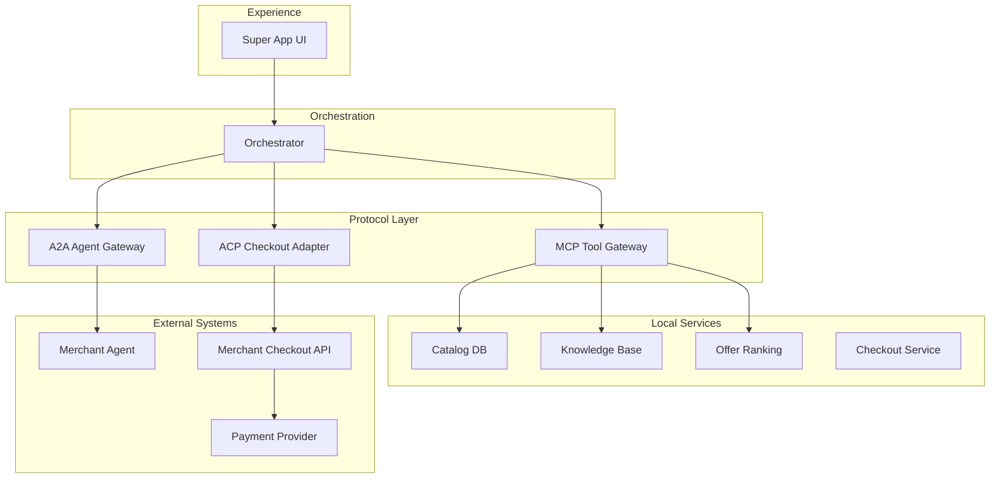
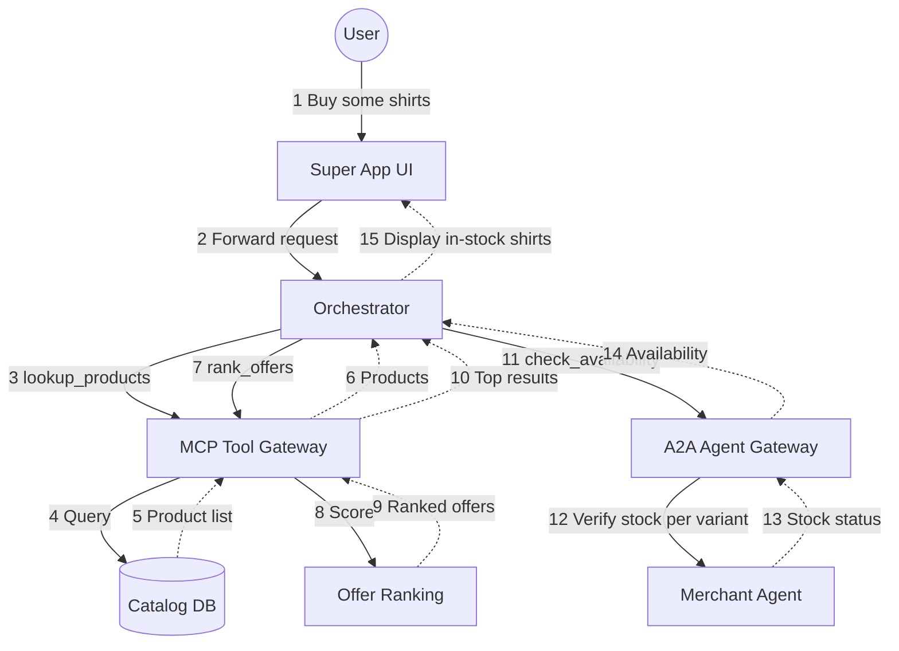
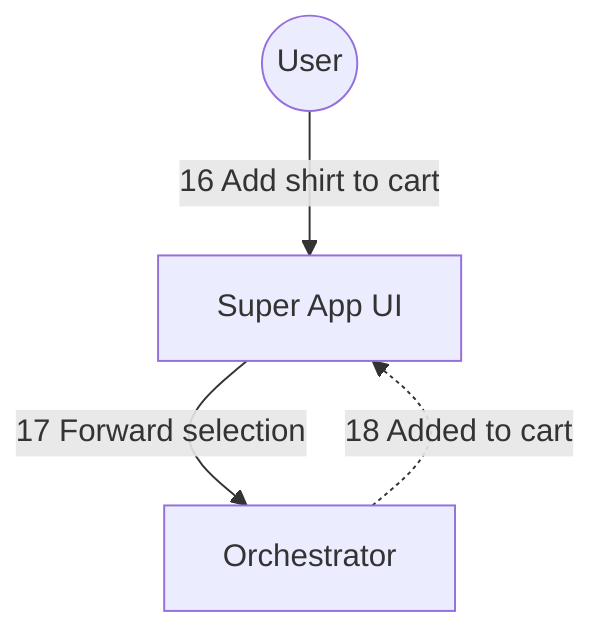
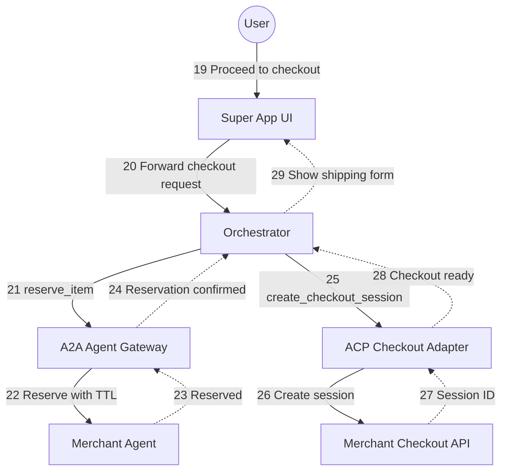
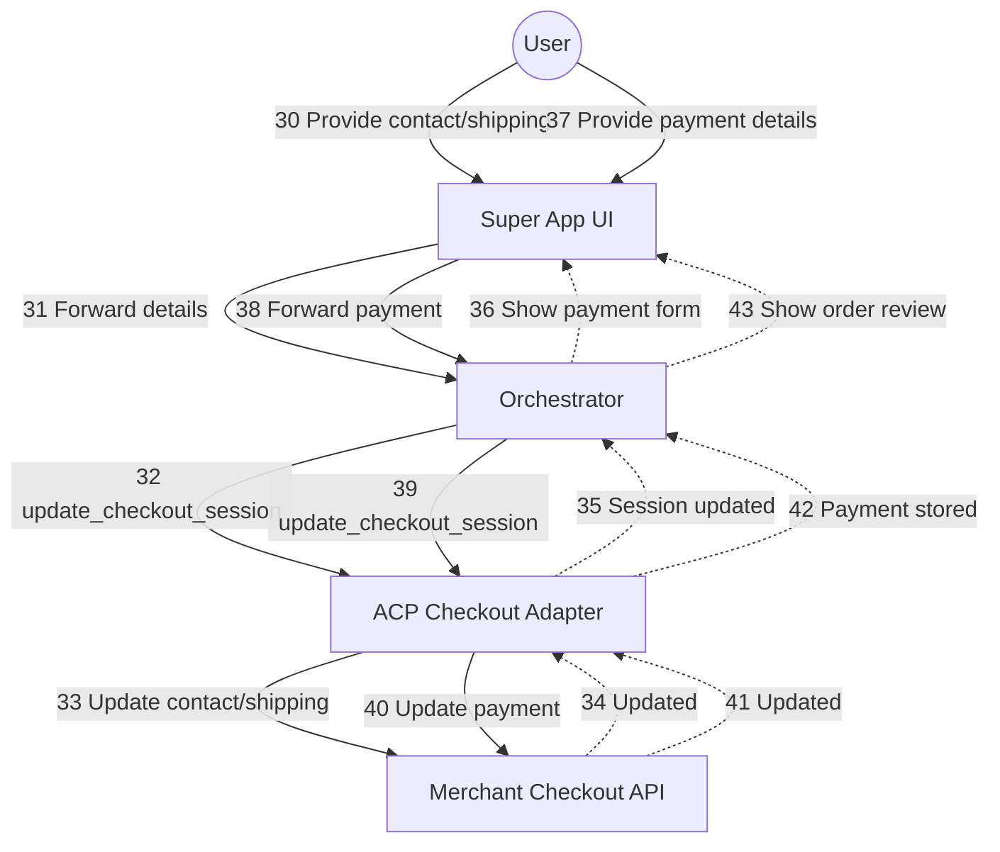
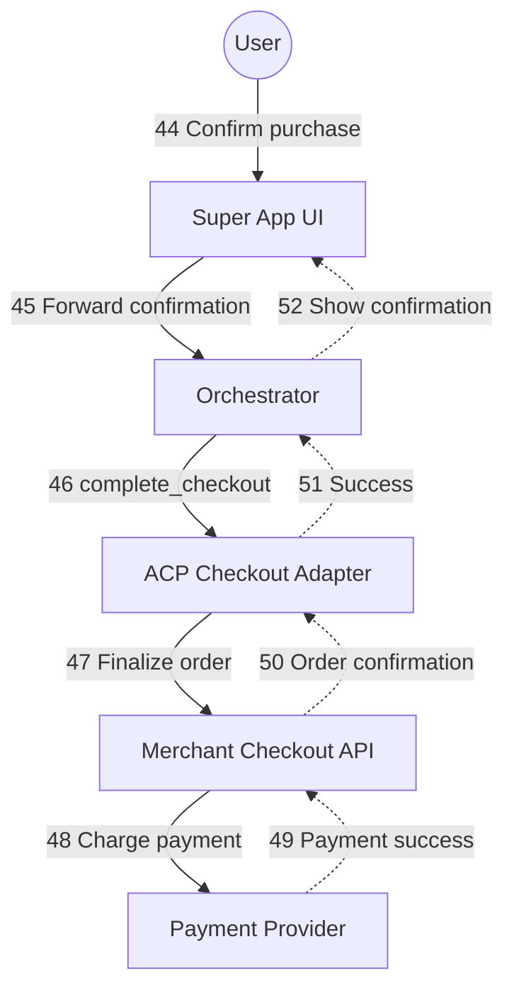
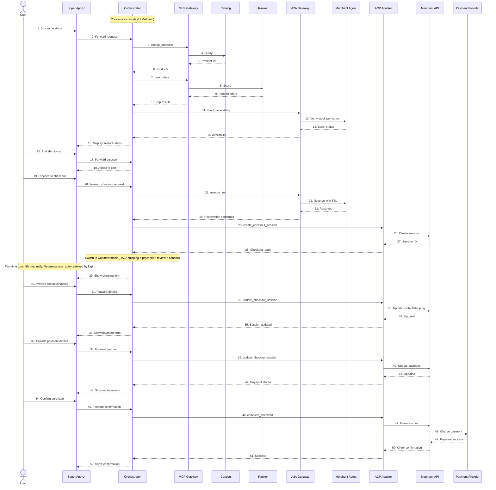

# Agentic Commerce MVP Architecture

## Overview

This document describes the layered architecture for an **Agentic E-commerce MVP** implemented inside a Super App environment.

The architecture demonstrates how three emerging interoperability protocols work together in a multi-agent system.

| Protocol | Purpose |
|---|---|
| MCP (Model Context Protocol) | Standard interface for AI systems to call tools and access external data |
| A2A (Agent-to-Agent Protocol) | Communication protocol between independent agents |
| ACP (Agentic Commerce Protocol) | Commerce protocol enabling AI agents to execute purchases |

These protocols address different integration challenges in agentic systems.

- **MCP** standardizes how AI applications access external tools and data sources.
- **A2A** enables agents operated by different organizations to collaborate.
- **ACP** standardizes the interaction between AI agents and merchant checkout systems.

Together they create a modular architecture for **agentic commerce**, separating language understanding, workflow orchestration, tool access, agent collaboration, and commerce execution.

---

# Architecture Diagram



---

# Layer Descriptions

## Layer 1 — Experience Layer

### Purpose

The Experience Layer provides the user-facing interface where users interact with the system.

This layer captures user input and renders responses generated by the agent system.

All reasoning, orchestration, and commerce execution occur in downstream layers.

### Component: Super App UI

The Super App UI represents the mobile or web interface embedded within the host platform.

**Responsibilities**

- Capture user input (text, voice, UI actions)
- Display conversational responses
- Render structured UI elements such as:
  - product cards
  - recommendation lists
  - checkout forms
- Collect structured information from users such as:
  - shipping address
  - payment confirmation
- Display transaction outcomes

**Example user interactions:**

- "Show me blue shirts under $50"
- "Add this to cart"
- "Checkout"

The UI layer focuses solely on presentation and interaction.

---

## Layer 2 — Orchestration Layer

The Orchestrator manages two execution modes and routes requests to the appropriate protocol.

See [Orchestrator Design](orchestrator-design.md) for full details.

### Component: Orchestrator

The Orchestrator combines intent understanding and workflow routing into a single component.

**Responsibilities**

- Interpret user intent (via LLM in conversation mode, via Fast Match / LLM Router in workflow mode)
- Manage mode transitions (conversation mode for discovery, workflow mode for checkout)
- Route requests to the correct protocol (MCP, A2A, ACP)
- Coordinate multi-step workflows
- Maintain session and DAG state

**Conversation mode** (discovery):

The LLM interprets natural language and decides actions in a single reasoning call.

```
"Find a blue shirt under $50"
  → intent: search_products
  → route: MCP tool (lookup_products)
```

**Workflow mode** (checkout):

A deterministic DAG processes expected inputs without LLM involvement.

```
Shipping form submitted
  → D2 Fast Match: expected input
  → route: ACP (update_checkout_session)
```

---

## Layer 3 — Protocol Layer

The Protocol Layer provides standardized interfaces that connect the orchestration layer with tools, external agents, and commerce systems.

### MCP Tool Gateway

The MCP Tool Gateway exposes internal services as tools that can be invoked by the orchestration layer.

The Model Context Protocol enables AI systems to access external tools, APIs, and data sources in a standardized way.

**Responsibilities**

- Register tool interfaces
- Provide tool schemas
- Execute tool calls
- Return structured responses

**Example MCP tools:**

```
lookup_products(query)
get_product_details(product_id)
rank_offers(product_list)
query_knowledge_base(question)
```

The `query_knowledge_base` tool provides RAG-based retrieval from the knowledge base. It is used in two contexts:

- **Conversation mode:** The conversation LLM calls it to answer user questions during discovery (e.g., "what's the return policy for this brand?")
- **Workflow mode (D3A):** The small/fast LLM calls it to answer quick questions during checkout (e.g., "how long does shipping take?")

Both modes use the same tool and knowledge base, ensuring consistent answers. The MCP interface decouples the tool from the calling LLM.

Through MCP, the system can interact with local services without embedding service-specific logic.

### A2A Agent Gateway

The A2A Gateway enables communication between independent agents.

This allows the Super App system to collaborate with merchant-side agents.

**Responsibilities**

- Discover external agents
- Send structured task requests
- Receive responses

**Example use cases:**

- inventory verification
- price confirmation
- order preparation

This enables cross-organization agent collaboration.

### ACP Checkout Adapter

The ACP Checkout Adapter executes commerce transactions using the Agentic Commerce Protocol.

ACP allows AI agents to interact directly with merchant checkout systems and complete purchases using existing payment infrastructure.

**Responsibilities**

- Create checkout sessions
- Update checkout information
- Complete purchases
- Pass delegated payment tokens

**Example ACP operations:**

```
create_checkout_session
update_checkout_session
complete_checkout
```

ACP enables agents to perform secure commerce transactions while merchants remain the merchant of record.

---

## Layer 4 — Local Services

Local services provide internal capabilities used during discovery and offer evaluation.

These services are exposed through MCP tools.

### Component: Catalog Database

The Catalog database stores product information.

**Responsibilities**

- Store product metadata
- Support search queries
- Provide product feeds for ranking

**Example fields:**

```
product_id
title
price
merchant_id
availability
```

### Component: Knowledge Base

The Knowledge Base stores unstructured content used to answer user questions via RAG retrieval.

**Responsibilities**

- Store and index unstructured content (policies, FAQs, product guides)
- Support semantic search via embeddings
- Return relevant documents for a given query

**Example content:**

- Return and refund policies
- Shipping times and methods
- Product care instructions
- Warranty information
- Brand-specific FAQs

This is the same knowledge base accessed by both the conversation LLM (during discovery) and the small/fast LLM (D3A quick questions during checkout), exposed as the `query_knowledge_base` MCP tool.

### Component: Offer Ranking Engine

The Offer Ranking Engine determines which products should be presented to the user.

**Responsibilities**

- Rank products by relevance
- Evaluate price competitiveness
- Incorporate user preferences

**Example ranking criteria:**

- price
- merchant reliability
- popularity
- user context

### Component: Checkout Service

The Checkout Service manages temporary checkout state before transaction execution.

**Responsibilities**

- Maintain cart state
- Store user selections
- Prepare checkout payloads
- Coordinate checkout interactions with merchant systems

This service acts as a bridge between the orchestration layer and merchant APIs.

---

## Layer 5 — External Systems

External systems represent the merchant and payment ecosystem responsible for executing the transaction.

### Merchant Agent

The Merchant Agent represents an autonomous agent operated by the merchant.

**Responsibilities**

- Confirm inventory availability
- Validate pricing
- Prepare orders

Communication with this agent occurs through the A2A protocol.

### Merchant Checkout API

The Merchant Checkout API represents the merchant's commerce backend.

**Responsibilities**

- Create checkout sessions
- Validate order details
- Finalize purchases
- Generate order confirmations

These APIs implement the Agentic Commerce Protocol.

### Payment Service Provider (PSP)

The Payment Service Provider processes payment transactions.

**Responsibilities**

- Generate delegated payment tokens
- Authorize transactions
- Confirm successful payments

In ACP flows, payment credentials are exchanged using single-use tokens, ensuring the agent never handles raw payment data.

---

# Scenario: Buy Some Shirts (Happy Path)

The following flowchart traces the happy path (95% of interactions) when a user says "I want to buy some shirts".

For unhappy path handling (unexpected user input during checkout), see [Orchestrator Design — LLM Router Exit Classification](orchestrator-design.md#llm-router-exit-classification).

### Phase 1: Discovery (Conversation Mode)

User says: "I want to buy some shirts". The orchestrator searches the catalog, ranks results, checks availability with merchant agents, and presents only in-stock products with variant-level stock annotations.



### Phase 2: Add to Cart (Conversation Mode)

User selects a product to add to their cart.



### Phase 3: Checkout Initiation (Conversation Mode → Workflow Mode)

User proceeds to checkout. The orchestrator reserves the item (soft lock with TTL), creates the ACP checkout session, and switches to workflow mode.



### Phase 4: Shipping and Payment (Workflow Mode)

User provides shipping and payment details. Each submission is a deterministic DAG step routed directly through ACP.



### Phase 5: Confirm and Pay (Workflow Mode)

User confirms the order. The merchant finalizes and charges payment via the PSP.



---

# End-to-End Transaction Flow (Happy Path)

The following sequence diagram illustrates the happy path (95% of interactions). For unhappy path handling, see [Orchestrator Design](orchestrator-design.md).



## End-to-End Flow Summary

1. The **Experience Layer** captures the user's request.
2. The **Orchestrator** interprets intent, plans the workflow, and routes to the appropriate protocol.
   - In conversation mode: LLM handles discovery, availability, cart, and reservation (steps 1-28)
   - In workflow mode: DAG handles checkout deterministically (steps 29-52), following `shipping → payment → review → confirm`
3. The **Protocol Layer** performs the required action:
   - **MCP** for tool access (discovery, ranking)
   - **A2A** for agent collaboration (availability check, item reservation)
   - **ACP** for commerce transactions (session creation, checkout updates, payment)
4. **Commerce Layer** services execute catalog search, merchant validation, checkout, and payment.

This layered architecture demonstrates how MCP, A2A, and ACP work together to enable agent-driven commerce transactions.