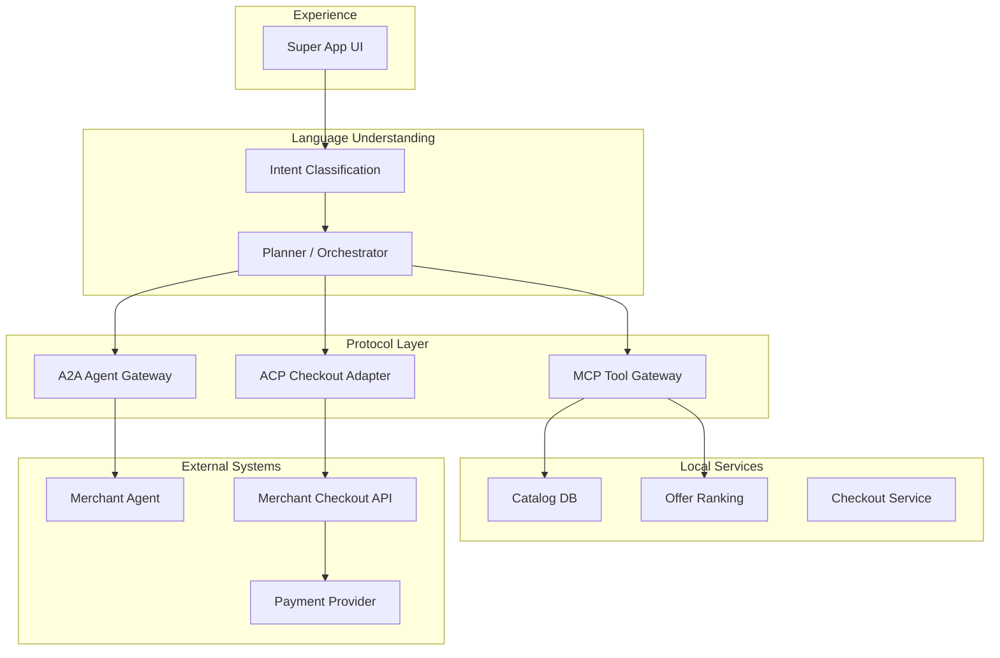
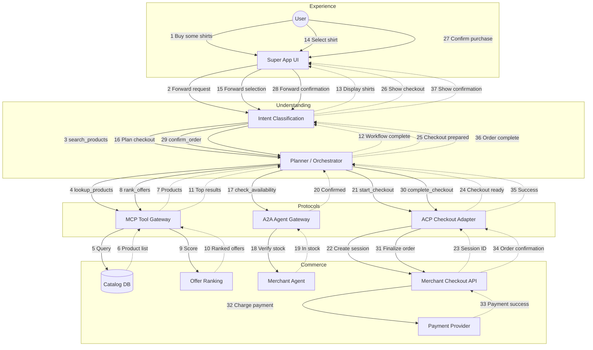
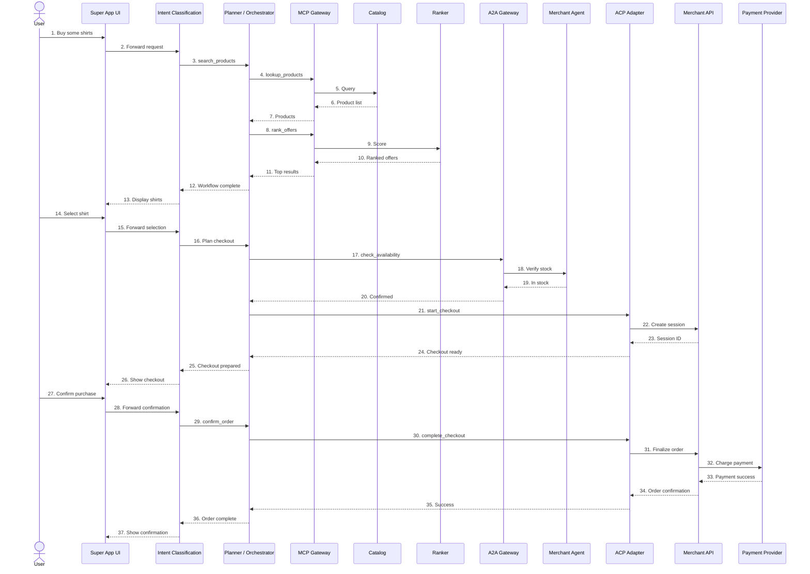

# Agentic Commerce MVP Architecture

## Overview

This document describes the layered architecture for an **Agentic E-commerce MVP** implemented inside a Super App environment.

The architecture demonstrates how three emerging interoperability protocols work together in a multi-agent system.

| Protocol | Purpose |
|---|---|
| MCP (Model Context Protocol) | Standard interface for AI systems to call tools and access external data |
| A2A (Agent-to-Agent Protocol) | Communication protocol between independent agents |
| ACP (Agentic Commerce Protocol) | Commerce protocol enabling AI agents to execute purchases |

These protocols address different integration challenges in agentic systems.

- **MCP** standardizes how AI applications access external tools and data sources.
- **A2A** enables agents operated by different organizations to collaborate.
- **ACP** standardizes the interaction between AI agents and merchant checkout systems.

Together they create a modular architecture for **agentic commerce**, separating language understanding, workflow orchestration, tool access, agent collaboration, and commerce execution.

---

# Architecture Diagram



---

# Layer Descriptions

## Layer 1 — Experience Layer

### Purpose

The Experience Layer provides the user-facing interface where users interact with the system.

This layer captures user input and renders responses generated by the agent system.

All reasoning, orchestration, and commerce execution occur in downstream layers.

### Component: Super App UI

The Super App UI represents the mobile or web interface embedded within the host platform.

**Responsibilities**

- Capture user input (text, voice, UI actions)
- Display conversational responses
- Render structured UI elements such as:
  - product cards
  - recommendation lists
  - checkout forms
- Collect structured information from users such as:
  - shipping address
  - payment confirmation
- Display transaction outcomes

**Example user interactions:**

- "Show me blue shirts under $50"
- "Add this to cart"
- "Checkout"

The UI layer focuses solely on presentation and interaction.

---

## Layer 2 — Language Understanding Layer

This layer converts natural language requests into structured workflow actions.

It contains two components:

- Intent Classification
- Planner / Orchestrator

### Component: Intent Classification

Intent Classification determines what the user wants to accomplish.

This component typically uses a large language model or classifier to interpret user requests.

**Responsibilities**

- Detect user intent
- Extract structured parameters (entities)
- Provide normalized input to the orchestration layer

**Example transformation:**

User input:

> Find a blue shirt under $50

Output:

```
intent = search_products
entities = {
  category: "shirt",
  color: "blue",
  price_max: 50
}
```

This component performs language understanding only, not workflow execution.

### Component: Planner / Orchestrator

The Planner / Orchestrator converts structured intents into executable workflows.

It acts as a deterministic routing layer that decides which protocol or service should be invoked.

**Responsibilities**

- Map intents to execution steps
- Route requests to the correct protocol
- Coordinate multi-step workflows
- Maintain simple task state

**Example routing logic:**

```
intent = search_products    → MCP tool
intent = check_availability → A2A merchant agent
intent = start_checkout     → ACP checkout adapter
```

This component contains minimal reasoning and is intentionally kept thin and deterministic.

---

## Layer 3 — Protocol Layer

The Protocol Layer provides standardized interfaces that connect the orchestration layer with tools, external agents, and commerce systems.

### MCP Tool Gateway

The MCP Tool Gateway exposes internal services as tools that can be invoked by the orchestration layer.

The Model Context Protocol enables AI systems to access external tools, APIs, and data sources in a standardized way.

**Responsibilities**

- Register tool interfaces
- Provide tool schemas
- Execute tool calls
- Return structured responses

**Example MCP tools:**

```
lookup_products(query)
get_product_details(product_id)
rank_offers(product_list)
```

Through MCP, the system can interact with local services without embedding service-specific logic.

### A2A Agent Gateway

The A2A Gateway enables communication between independent agents.

This allows the Super App system to collaborate with merchant-side agents.

**Responsibilities**

- Discover external agents
- Send structured task requests
- Receive responses

**Example use cases:**

- inventory verification
- price confirmation
- order preparation

This enables cross-organization agent collaboration.

### ACP Checkout Adapter

The ACP Checkout Adapter executes commerce transactions using the Agentic Commerce Protocol.

ACP allows AI agents to interact directly with merchant checkout systems and complete purchases using existing payment infrastructure.

**Responsibilities**

- Create checkout sessions
- Update checkout information
- Complete purchases
- Pass delegated payment tokens

**Example ACP operations:**

```
create_checkout_session
update_checkout_session
complete_checkout
```

ACP enables agents to perform secure commerce transactions while merchants remain the merchant of record.

---

## Layer 4 — Local Services

Local services provide internal capabilities used during discovery and offer evaluation.

These services are exposed through MCP tools.

### Component: Catalog Database

The Catalog database stores product information.

**Responsibilities**

- Store product metadata
- Support search queries
- Provide product feeds for ranking

**Example fields:**

```
product_id
title
price
merchant_id
availability
```

### Component: Offer Ranking Engine

The Offer Ranking Engine determines which products should be presented to the user.

**Responsibilities**

- Rank products by relevance
- Evaluate price competitiveness
- Incorporate user preferences

**Example ranking criteria:**

- price
- merchant reliability
- popularity
- user context

### Component: Checkout Service

The Checkout Service manages temporary checkout state before transaction execution.

**Responsibilities**

- Maintain cart state
- Store user selections
- Prepare checkout payloads
- Coordinate checkout interactions with merchant systems

This service acts as a bridge between the orchestration layer and merchant APIs.

---

## Layer 5 — External Systems

External systems represent the merchant and payment ecosystem responsible for executing the transaction.

### Merchant Agent

The Merchant Agent represents an autonomous agent operated by the merchant.

**Responsibilities**

- Confirm inventory availability
- Validate pricing
- Prepare orders

Communication with this agent occurs through the A2A protocol.

### Merchant Checkout API

The Merchant Checkout API represents the merchant's commerce backend.

**Responsibilities**

- Create checkout sessions
- Validate order details
- Finalize purchases
- Generate order confirmations

These APIs implement the Agentic Commerce Protocol.

### Payment Service Provider (PSP)

The Payment Service Provider processes payment transactions.

**Responsibilities**

- Generate delegated payment tokens
- Authorize transactions
- Confirm successful payments

In ACP flows, payment credentials are exchanged using single-use tokens, ensuring the agent never handles raw payment data.

---

# Scenario: Buy Some Shirts

The following flowchart traces the dataflow when a user says "I want to buy some shirts".



---

# End-to-End Transaction Flow

The following sequence diagram illustrates how all layers interact to complete a purchase.


## End-to-End Flow Summary

1. The **Experience Layer** captures the user's request.
2. **Intent Classification** determines the user's intent.
3. The **Planner / Orchestrator** determines the workflow and selects the appropriate protocol.
4. The **Protocol Layer** performs the required action:
   - **MCP** for tool access
   - **A2A** for agent collaboration
   - **ACP** for commerce transactions
5. **Local Services** support product discovery and ranking.
6. **External Systems** execute checkout and payment.

This layered architecture demonstrates how MCP, A2A, and ACP work together to enable agent-driven commerce transactions.