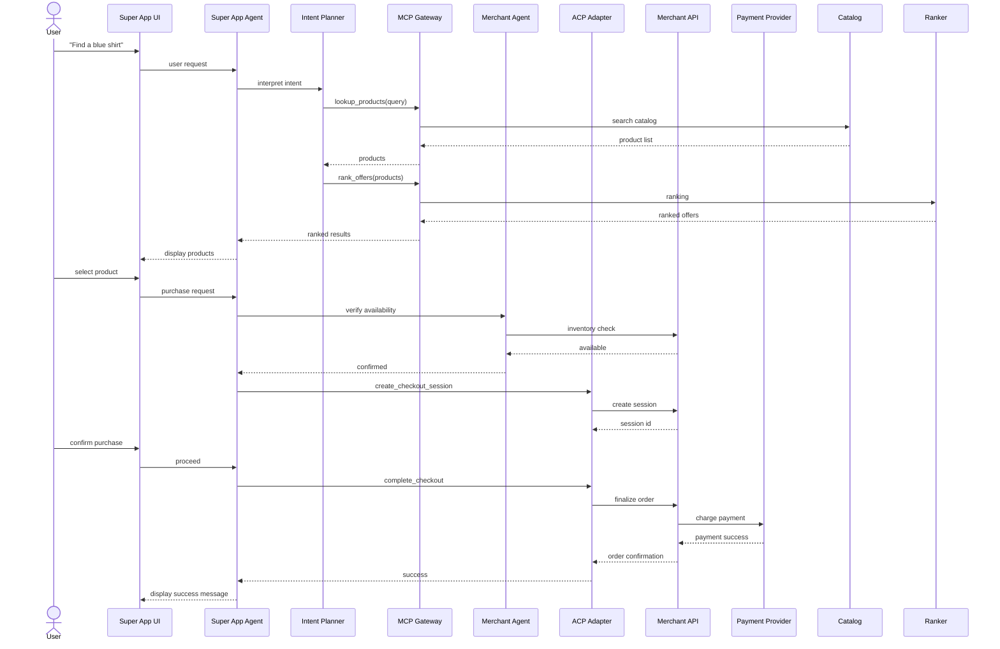

# Agentic Commerce MVP Architecture

## Overview

This document describes the layered architecture for an **Agentic E-commerce MVP** implemented inside a Super App environment.

The architecture demonstrates how three emerging interoperability protocols work together in a multi-agent system:

| Protocol | Purpose |
|---|---|
| MCP (Model Context Protocol) | Standard interface for AI agents to call tools and access data |
| A2A (Agent-to-Agent Protocol) | Communication protocol between independent agents |
| ACP (Agentic Commerce Protocol) | Commerce protocol enabling agents to complete purchases |

These protocols address different integration challenges in agentic systems:

- **MCP** standardizes how AI agents interact with external tools, APIs, and data sources.
- **A2A** enables autonomous agents to collaborate and exchange structured tasks across systems.
- **ACP** enables AI agents to initiate and complete purchases directly with merchants.

Together they create a modular stack for **agentic commerce systems**, separating reasoning, tool access, agent collaboration, and transaction execution.

---

## Architecture Diagram

```mermaidI
flowchart TB

subgraph L1[Experience]
UI[Super App UI]
end

subgraph L2[Agent Layer]
Agent[Super App Agent]
Planner[Intent Planner]
end

subgraph L3[Protocol Layer]
MCP[MCP Tool Gateway]
A2A[A2A Agent Gateway]
ACP[ACP Checkout Adapter]
end

subgraph L4[Local Services]
Catalog[Catalog DB]
Ranker[Offer Ranking]
Checkout[Checkout Service]
end

subgraph L5[External Systems]
MerchantAgent[Merchant Agent]
MerchantAPI[Merchant Checkout API]
PSP[Payment Provider]
end

UI --> Agent
Agent --> Planner

Planner --> MCP
Planner --> A2A
Planner --> ACP

MCP --> Catalog
MCP --> Ranker

A2A --> MerchantAgent

ACP --> MerchantAPI
MerchantAPI --> PSP
```

---

## Layer Descriptions

### Layer 1 — Experience Layer

**Purpose**

The Experience Layer provides the user-facing interface where end users interact with the system.

This layer is responsible for:
- capturing user input
- presenting results generated by the agent
- rendering structured commerce UI components

The Experience Layer contains no decision-making logic. All reasoning and orchestration occurs in downstream layers.

#### Component: Super App UI

The Super App UI represents the mobile or web application interface embedded inside the host platform.

**Responsibilities**
- Capture user inputs (text, voice, or UI interaction)
- Display conversational responses generated by the agent
- Render structured UI components: product cards, recommendation lists, checkout forms
- Collect structured user inputs such as shipping address and payment confirmation
- Display transaction results (success / failure)

**Example user interactions**
- "Show me blue shirts under $50"
- "Add this to cart"
- "Checkout"

The UI layer focuses purely on presentation and interaction.

---

### Layer 2 — Agent Layer

**Purpose**

The Agent Layer is responsible for interpreting user intent and orchestrating actions across the system. This layer acts as the control plane of the architecture.

**Responsibilities**
- Understand natural language requests
- Plan workflows
- Select the correct protocol interface
- Coordinate downstream services

#### Component: Super App Agent

The Super App Agent represents the buyer agent acting on behalf of the user.

**Responsibilities**
- Maintain conversation context
- Interpret user intent
- Orchestrate multi-step workflows
- Aggregate responses from tools, agents, and commerce systems

The agent decides whether to use MCP for tools, A2A for agent collaboration, or ACP for transactions.

#### Component: Intent Planner

The Intent Planner converts natural language requests into structured execution plans.

**Example plan for "Find a blue shirt under $50":**
1. Search product catalog
2. Rank product offers
3. Verify merchant availability
4. Initiate checkout session

**Responsibilities**
- Classify user intent
- Decompose tasks
- Determine which protocol should be invoked

The planner ensures that complex workflows can be executed step-by-step.

---

### Layer 3 — Protocol Layer

**Purpose**

The Protocol Layer provides standardized interfaces that allow the agent to interact with tools, other agents, and commerce systems. This layer enables interoperability across heterogeneous services.

#### MCP Tool Gateway

The MCP Tool Gateway exposes internal services as tools that can be invoked by the agent.

The Model Context Protocol (MCP) standardizes communication between AI agents and external systems such as APIs, databases, and tools.

**Responsibilities**
- Register tool interfaces
- Provide tool schemas
- Execute tool calls
- Return structured results

**Example tools**
```
lookup_products(query)
get_product_details(product_id)
rank_offers(product_list)
```

Through MCP, the agent can access internal services without embedding service-specific logic.

#### A2A Agent Gateway

The A2A Gateway enables communication between independent agents, allowing the Super App agent to interact with external partner agents.

**Responsibilities**
- Discover external agents
- Send structured requests
- Receive responses

**Example use cases**
- Inventory validation
- Merchant negotiation
- Offer verification

This enables cross-organization agent collaboration.

#### ACP Checkout Adapter

The ACP Checkout Adapter executes commerce transactions using the Agentic Commerce Protocol. ACP enables agents to initiate purchases with merchant systems while using existing payment infrastructure.

**Responsibilities**
- Create checkout sessions
- Update checkout information
- Complete purchases
- Submit delegated payment tokens

**Example ACP operations**
```
create_checkout_session
update_checkout_session
complete_checkout
```

ACP enables AI agents to complete purchases directly within conversational interfaces.

---

### Layer 4 — Local Services

**Purpose**

Local services provide internal data and business logic that support the agent's operations. These services are exposed through MCP tools.

#### Component: Catalog Database

The Catalog database stores product information.

**Responsibilities**
- Store product metadata
- Support product search queries
- Provide product feeds for ranking

**Example fields:** `product_id`, `title`, `price`, `merchant_id`, `availability`

#### Component: Offer Ranking Engine

The Offer Ranking Engine determines which products should be presented to the user.

**Responsibilities**
- Rank products by relevance
- Evaluate price competitiveness
- Incorporate user preferences

**Example ranking criteria:** price, merchant reliability, popularity, user context

#### Component: Checkout Service

The Checkout Service manages temporary checkout state before transaction execution.

**Responsibilities**
- Store cart state
- Manage user selections
- Prepare checkout payloads
- Coordinate checkout requests with merchant APIs

This service acts as the bridge between the agent and merchant systems.

---

### Layer 5 — External Systems

**Purpose**

External systems represent the merchant and payment ecosystem responsible for executing the final transaction.

#### Merchant Agent

The Merchant Agent represents an autonomous agent operated by the merchant.

**Responsibilities**
- Confirm product availability
- Validate pricing
- Prepare orders

Communication with this agent occurs through the A2A protocol.

#### Merchant Checkout API

The Merchant Checkout API represents the merchant's commerce backend.

**Responsibilities**
- Create checkout sessions
- Validate order details
- Finalize purchases
- Generate order confirmations

These APIs implement the Agentic Commerce Protocol.

#### Payment Service Provider (PSP)

The Payment Service Provider processes payment transactions.

**Responsibilities**
- Generate delegated payment tokens
- Authorize transactions
- Confirm successful payments

In ACP flows, payment credentials are exchanged as single-use tokens, ensuring the agent never handles raw payment data.

---

## End-to-End Transaction Flow

The following sequence diagram illustrates how all layers interact to complete a purchase.



### End-to-end Flow Summary

1. The **Experience Layer** captures the user's intent.
2. The **Agent Layer** interprets the request and plans execution.
3. The **Protocol Layer** selects the correct interface:
   - MCP for tools
   - A2A for agent collaboration
   - ACP for transaction execution
4. **Local Services** provide discovery and ranking capabilities.
5. **External Systems** process checkout and payment.

This layered architecture demonstrates how MCP, A2A, and ACP operate together in an agentic commerce environment.
