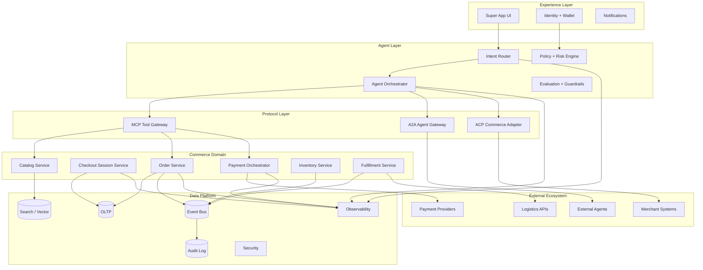

## Layered production diagram

## Component responsibilities (what must be “production-grade”)

**Experience layer (super‑app frontend).** Your competitive edge is multi-surface UX: chat + product cards + embedded mini-apps. The system design implication: the frontend must support **progressive disclosure** (recommendations → compare → confirm), explicit user confirmation steps (especially for purchases), and interruption/rollback affordances (“cancel checkout,” “change shipping,” “switch payment”). OpenAI’s Instant Checkout UX and “Buy button” flow show the baseline user expectation for embedded checkout. 

**Agent orchestration.** Treat this as a control plane: intent routing, planning, tool selection, and governance. If you adopt OpenAI’s agent tooling, OpenAI documents agent workflows, MCP tool calling, and deployment surfaces (e.g., Agents SDK and MCP tool in Responses API), which gives you a reference for orchestration primitives (handoffs, tool calls, traces). 

**ACP adapter.** Implement as a dedicated boundary layer so your internal domain model (offers, carts, orders) can map cleanly to ACP requirements: version headers, idempotency headers, authoritative cart responses, and signed webhooks. 

**MCP mesh.** Use MCP to expose internal tools/data (catalog query, order lookup, loyalty eligibility, fraud signals) to your agents with consistent schemas and centralized auth policies. MCP’s host/client/server model provides a stable contract for that mesh. 

**A2A gateway.** Use when a partner is better modeled as an agent (negotiation, iterative clarification, long-running tasks, multi-modal results). A2A’s emphasis on discovery (AgentCards), modality negotiation, and task management fits “merchant concierge” and “fulfillment coordinator” patterns. 

**Commerce core.** Separate “commerce correctness” from “agent reasoning.” The checkout agent should not become your system of record. ACP explicitly keeps orders/payments/compliance on the merchant’s stack; mirror that principle internally: orders service is the SOR; payments orchestrator is safety-critical; inventory reservation must be deterministic and idempotent. 

**Observability + security + governance.** Agentic commerce expands attack surface (prompt injection, tool misuse, model DoS, supply chain vulnerabilities). OWASP explicitly documents these emerging LLM risks; OpenAI’s commerce production guidance calls out TLS requirements, PCI-scope boundaries, signed webhooks, and allowlisting outbound IP ranges.