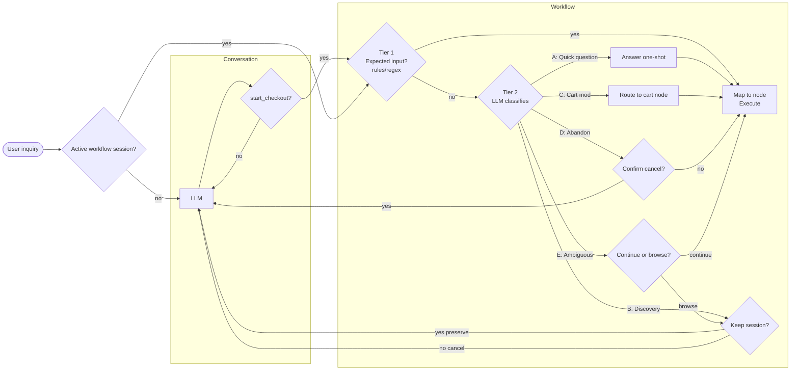
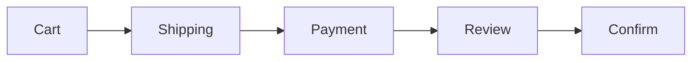
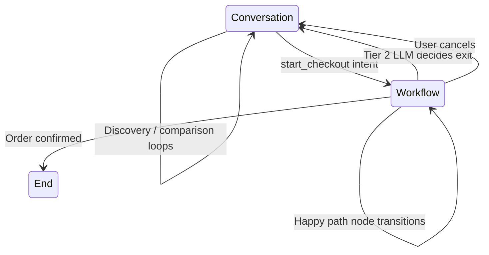

# Orchestrator Design

## Overview

The orchestrator is the control plane of the agentic commerce system. It manages two execution modes and the transitions between them.

The core design principle: **deterministic speed on the happy path, LLM flexibility only when needed.**

| | Deterministic workflow | LLM reasoning |
|---|---|---|
| Latency | ~50-100ms (REST) | ~1-3s (LLM call) |
| Predictability | 100% | Variable |
| Flexibility | Zero, fixed paths only | Handles anything |

---

## Execution Modes

The orchestrator operates in two modes:

### Conversation Mode (LLM-driven)

Used for discovery, comparison, and recommendations.

The LLM interprets natural language, calls tools via MCP, collaborates with merchant agents via A2A, and generates responses.

**Entry conditions:**
- Session start
- User says something unexpected during checkout (re-entry from workflow mode)

**Exit condition:**
- `start_checkout` intent is detected, transition to workflow mode

### Workflow Mode (DAG-driven)

Used for checkout execution.

A deterministic state machine processes expected inputs (form data, button clicks) without LLM involvement. Each step is a direct REST call through the ACP protocol.

**Entry condition:**
- `start_checkout` intent detected in conversation mode

**Exit conditions:**
- Order confirmed (success)
- User cancels
- User says something that requires returning to conversation mode

---

## Two-Tier Input Classification

Every user input during workflow mode passes through a two-tier classifier:

```
User input
  -> Tier 1: Fast check (regex, rules, ~0ms)
     -> Matches expected workflow action? -> Execute deterministically
     -> No match? -> Tier 2: Full LLM (~1-2s)
        -> Navigate to unlocked node
        -> Return to conversation mode
        -> Clarify intent
```

### Orchestrator Flow Diagram



### Tier 1: Rule-Based Classifier

The first tier checks whether user input matches expected actions for the current workflow node.

**Implementation:** regex patterns + expected field matching per node.

**Examples:**

| Current node | Expected input | Tier 1 match |
|---|---|---|
| shipping | Address form submission | Yes, process directly |
| payment | Credit card details | Yes, process directly |
| review | "Confirm" button click | Yes, advance to confirm |
| payment | "change my address" | No, escalate to Tier 2 |
| review | "show me other shirts" | No, escalate to Tier 2 |

**MVP approach:** Start with rules. Graduate to a lightweight classifier model when training data is available from production usage.

### Tier 2: LLM Classifier

The second tier handles unexpected inputs that Tier 1 cannot match.

The LLM receives the current workflow state and user input, then decides:

| LLM decision | Action |
|---|---|
| Navigate to unlocked node | Route user to the target node (e.g., "change my address" -> shipping node) |
| Return to conversation mode | Exit workflow, re-enter conversation (e.g., "show me other shirts") |
| Clarify | Ask the user what they mean |
| Continue | Input was just a comment, stay on current node |

---

## Workflow DAG

The checkout workflow is a directed acyclic graph (DAG) where each node represents a checkout step.

### Node Definition

Each node defines:

| Property | Description |
|---|---|
| `id` | Unique node identifier |
| `preconditions` | What data must be present before this node is accessible |
| `expected_inputs` | Input patterns that Tier 1 can match |
| `transitions` | Valid next nodes |
| `acp_operation` | The ACP call executed when this node completes |

### Default Checkout DAG

```
cart -> shipping -> payment -> review -> confirm
```



### Node Details

| Node | Preconditions | Expected inputs | ACP operation | Unlocked when |
|---|---|---|---|---|
| cart | None | Add/remove items, update quantities | `create_checkout_session` | Always |
| shipping | Cart has items | Address form fields | `update_checkout_session` | Cart has items |
| payment | Shipping is filled | Payment method, card details | `update_checkout_session` | Shipping is filled |
| review | Payment is filled | Confirm or edit | None (read-only) | Payment is filled |
| confirm | Review is seen | Confirm button | `complete_checkout` | Review is seen |

### Node Unlocking

Nodes unlock progressively based on preconditions:

```
cart: always unlocked
shipping: unlocked when cart has items
payment: unlocked when shipping is filled
review: unlocked when payment is filled
confirm: unlocked when review is seen
```

The LLM (Tier 2) can route the user to any **unlocked** node. It cannot skip ahead to locked nodes.

**Example:** A user on the payment node says "change my address."
1. Tier 1 does not match (not a payment input)
2. Tier 2 LLM classifies: navigate to shipping node
3. Shipping node is unlocked (was already completed)
4. User is routed to shipping node with pre-filled data
5. After update, workflow resumes from shipping forward

---

## Latency Profile

| Scenario | Path | Latency |
|---|---|---|
| Happy path checkout step | Tier 1 match, deterministic execution | ~50-100ms |
| Navigate to another node | Tier 1 miss, Tier 2 LLM, route to node | ~1-2s |
| Exit to conversation mode | Tier 1 miss, Tier 2 LLM, mode switch | ~1-2s |
| Discovery and comparison | Always LLM (conversation mode) | ~1-3s (expected) |

Users tolerate latency during browsing (feels conversational). They do not tolerate it during checkout (feels slow). This design places LLM latency only where users accept it.

---

## Mode Transitions



### Conversation to Workflow

Trigger: Intent Classification detects `start_checkout`.

The orchestrator:
1. Creates a checkout session via ACP
2. Initializes the DAG state (cart node)
3. Switches to workflow mode
4. If returning user, auto-retrieves contact/shipping/payment from profile

### Workflow to Conversation

Trigger: Tier 2 LLM classifies user input as requiring conversation mode.

The exit path depends on the category of intent detected. See [Tier 2 Exit Classification](#tier-2-exit-classification) below.

---

## Auto-Retrieval for Returning Users

On entering workflow mode, the orchestrator checks if the user has stored profile data:

| Data | Source | Effect |
|---|---|---|
| Contact details | User profile (by login) | Pre-fill shipping node |
| Shipping address | User profile (by login) | Pre-fill shipping node |
| Payment method | Tokenized via PSP | Pre-fill payment node |

If all data is available, the orchestrator can skip directly to the review node, unlocking the fast checkout path:

```
cart -> review -> confirm
```

Nodes are pre-filled but remain unlocked for editing.

---

## Future-Proofing

### Data-Driven DAG

The workflow DAG is defined as configuration, not code. This enables:

- Different merchants to define different checkout flows
- Adding new nodes (loyalty, gift wrapping, coupon) without orchestrator code changes
- A/B testing different checkout sequences

### Swappable Tier 1 Classifier

The Tier 1 classifier interface is abstracted:

- **MVP:** Regex and rule-based matching
- **Future:** Lightweight fine-tuned model (~20ms inference)
- The orchestrator does not depend on the implementation

### Protocol-Agnostic

The orchestrator manages state and routing. Protocol details (ACP, MCP, A2A) are implementation details of individual nodes and mode handlers. The orchestrator does not know about protocol specifics.

---

## Delegated Payment Token

During the payment node, the system uses a delegated payment token pattern:

1. The UI creates a shared payment token directly with the PSP (client-side)
2. The token is passed through the checkout completion call
3. The merchant uses the token to create a payment intent with the PSP
4. The orchestrator and gateway never handle raw payment credentials

This follows the ACP delegated payment model where the merchant remains the merchant of record.

---

## Tier 2 Exit Classification

When Tier 2 determines the user wants to leave the current workflow node, it classifies the intent into one of five categories.

### Category A: Quick Question

**Examples:** "What's the return policy?", "How long does shipping take?"

The user does not actually want to leave checkout. They need information, then continue.

**Handling:**
1. Stay in workflow mode
2. Answer via LLM (one-shot, no mode switch)
3. Auto-return to current node
4. Checkout session untouched

### Category B: Discovery / Comparison

**Examples:** "Show me similar shirts", "Are there better deals?", "Let me look at pants too"

The user wants to browse. The checkout session may or may not survive.

**Handling:**
1. Ask: "Would you like to keep your current checkout open while you browse?"
2. If yes: preserve session, enter conversation mode
3. If no: cancel ACP session, enter conversation mode, start fresh

### Category C: Cart Modification

**Examples:** "I want to add more items first", "Remove the second shirt"

This is not an exit. It is a navigation to the cart node within the workflow.

**Handling:**
1. Route to cart node (stay in workflow mode)
2. After cart update, workflow resumes from cart forward
3. Downstream nodes (shipping, payment) may need re-validation

### Category D: Abandonment

**Examples:** "I don't want to buy anything", "Cancel"

The user wants out entirely.

**Handling:**
1. Confirm: "Are you sure you want to cancel your checkout?"
2. If yes: cancel ACP session, enter conversation mode
3. If no: return to current workflow node

### Category E: Ambiguous

**Examples:** "Hmm, I'm not sure", "Let me think about it"

Intent is unclear. Needs clarification.

**Handling:**
1. Ask: "Would you like to continue with checkout or browse more?"
2. If continue: return to current workflow node
3. If browse: treat as Category B

### Decision Tree Summary

```
Tier 2 classifies exit intent
|
+-- A: Quick question
|   -> Answer via LLM (one-shot)
|   -> Auto-return to current node
|   -> Session untouched
|
+-- B: Discovery / comparison
|   -> Ask: "Keep current checkout open?"
|   +-- Yes -> Preserve session, conversation mode
|   +-- No  -> Cancel session, conversation mode
|
+-- C: Cart modification
|   -> Route to cart node (stay in workflow)
|
+-- D: Abandonment
|   -> Confirm: "Cancel checkout?"
|   +-- Yes -> Cancel session, conversation mode
|   +-- No  -> Return to current node
|
+-- E: Ambiguous
    -> Clarify: "Continue checkout or browse more?"
    +-- Continue -> Return to current node
    +-- Browse   -> Treat as Category B
```

---

## Re-Entry to Workflow from Conversation Mode

After a Category B exit, the user may want to return to checkout.

### With Preserved Session

| User says | Action |
|---|---|
| "I'm ready to checkout" | Resume from last active node |
| "Add this to my cart" | Merge item into existing session, route to cart node |
| "Checkout with this instead" | Ask: "Replace your current cart or add to it?" |

### Without Preserved Session

| User says | Action |
|---|---|
| "I want to checkout" | Start fresh, create new ACP session |

### Session Timeout

The merchant's ACP checkout session may expire while the user browses in conversation mode.

| Situation | Action |
|---|---|
| User returns, session still valid | Resume normally |
| User returns, session expired | Silently create new session, re-populate from preserved DAG state |
| User returns, product unavailable | Notify user, offer alternatives via conversation mode |

The orchestrator preserves the DAG state (node data, user inputs) independently of the ACP session. If the merchant session expires, the orchestrator can rebuild it from the preserved state without the user noticing.
